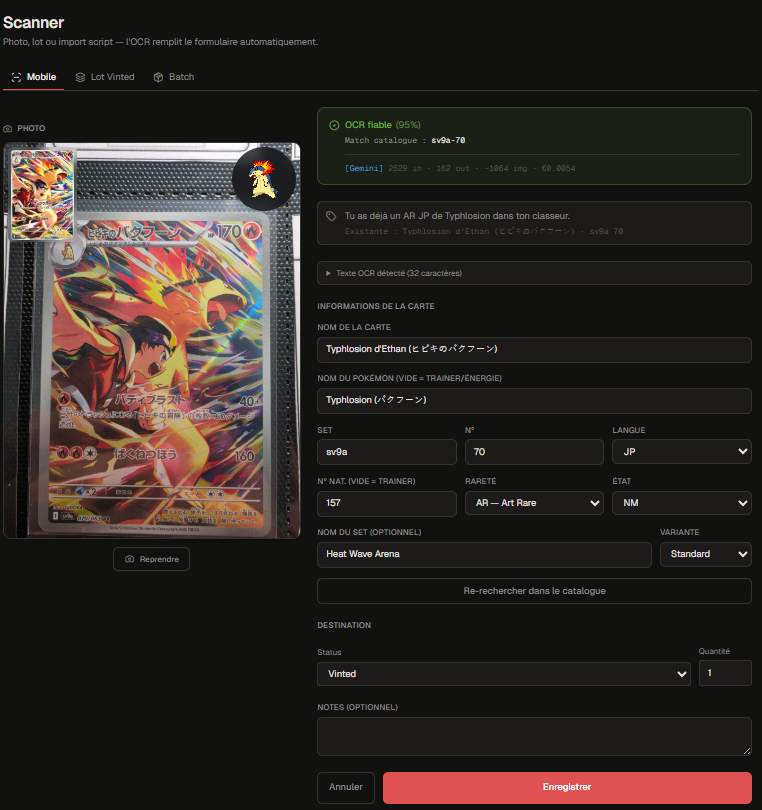

<div align="center">


# I.R.I.S

### Intelligent Recognition Inventory System

**A two-user PWA to manage a shared Pokémon TCG collection — scan, catalog, price, list and sell, all from one app.**

[](https://nextjs.org)
[](https://react.dev)
[](https://www.typescriptlang.org)
[](https://tailwindcss.com)
[](https://supabase.com)
[](#testing)
[](#)

[Features](#-features) · [Quick start](#-quick-start) · [Tech stack](#-tech-stack) · [Documentation](#-documentation) · [Screenshots](#-screenshots)

</div>

---

## 📖 What is I.R.I.S?

I.R.I.S is a Progressive Web App that turns a phone camera into a complete Pokémon TCG inventory and resale workflow for two collaborating collectors.

Point the camera at a card → multilingual OCR (Japanese, English, French, Korean, Chinese) extracts name + set + number → the catalog (52K+ cards) enriches with rarity, illustrator, official image and live Cardmarket pricing → the card lands either in a personal **Pokédex** (1 card per Pokémon, all 1025 species), a shared **Stock**, or a **Vinted-ready listing** with auto-generated annonce. Cards are tracked per-user with Postgres Row-Level Security so each collector lists from their own Vinted account while the underlying inventory is shared.

> Built solo over ~3 months as a real product for a real use case (managing a couple's TCG collection across two Vinted accounts), now used daily.

## ✨ Features

### Capture & enrich
- 📷 **Multi-engine OCR** — Gemini 3.1 Flash Lite (primary, ~93% accuracy) with Google Vision automatic fallback. Cost: ~€0.0004 per scan.
- 🌍 **5 supported languages** — Japanese, English, French, Korean, Chinese, with Gemini extracting bilingual names (`"Gruikui (チャオブー)"` for FR cards with original JP name).
- 🗂 **Local catalog** — 52K cards scraped from LimitlessTCG, queried offline first; live TCGdex API as fallback for new sets.
- 🔍 **6-strategy enrichment pipeline** — set code → set total → name+illustrator disambiguation → subseries probes (TG/GG/promos) → TCGdex live → Gemini-only last resort.

### Organize
- 🎴 **Pokédex view** — exactly 1 card per Pokémon (1025 slots), 3 display modes (large grid / compact grid / list), search by Pokémon number or name, swap-on-replace flow when promoting from Stock or Vinted.
- 📦 **Stock view** — physical inventory mirror, count chips for duplicate copies, instant clone button.
- 🛒 **Vinted view** — for-sale pile with state chips (offline / online / stale / sold), bulk-sold flow with per-card price split, restock proposals, partner cleanup notices.
- 📚 **Lots** — bundle multiple cards as one Vinted listing with custom photos and template.

### Price & sell
- 💰 **Live Cardmarket pricing** — daily cron pulls the official S3 dumps (67K products + 72K pricing rows) into Postgres; per-card matching via `(expansion, set_number)` index — no name fuzzy-matching required.
- 🔗 **Cardmarket deep links** — every priced card shows a "View on Cardmarket" link to verify the matched product page.
- 📝 **Smart annonce generator** — bilingual title (smart-truncated to 80 chars), templated description with shipping block, copy-to-clipboard + downloadable card image (PNG, anti-bot stripped).
- 📊 **Dashboard** — KPI tiles (stock value, OCR cost 30d, scan count, restock alerts), 4 charts (cost stacked bar, stock-value area, rarity drill-down donut, 52-week scan heatmap), top rares table.

### Collaborate
- 👥 **2-user architecture** — `card_listings` and `lot_listings` tables track per-user listed state with RLS scoped by `auth.uid()`. Cards/lots are shared, listings are personal.
- 🎨 **Identity colors** — each user has a distinct color across the UI (badges, action labels) so it's always clear who listed what.
- ⚡ **Cross-user sold flow** — marking a partner's listing as sold triggers a cleanup notice, optional restock proposal chains correctly across both accounts.

### Operate
- 🔄 **Daily cron** — Vercel cron refreshes Cardmarket pricing nightly; GitHub Actions cron snapshots the database to gzipped releases (rotation 30/12/12).
- 💾 **Manual backups** — one-click full database dump from Options page, stored in a Supabase bucket with signed-URL download.
- 📱 **Installable PWA** — manifest + maskable icons + auto-show install banner (Chrome / Edge / Android) + iOS Safari "Add to Home Screen" guide.

## 🛠 Tech stack

| Layer | Choice | Why |
|---|---|---|
| **Framework** | Next.js 16 (App Router) | Server components for data-loading pages, Edge runtime where it matters, file-system routing, built-in optimization. |
| **Language** | TypeScript (strict) | End-to-end type safety, including the database via Supabase generated types. |
| **UI** | React 19 + Tailwind v4 | Tailwind v4 uses `@theme` in CSS (no JS config). Lucide icons. |
| **Database** | Supabase (Postgres + Storage + Auth + RLS) | Managed Postgres with first-class RLS, S3-compatible Storage for card photos, magic-link/password auth out of the box. |
| **OCR** | Gemini 3.1 Flash Lite Preview (primary), Google Vision (fallback) | Gemini extracts structured JSON in one call (vs Vision's raw text + regex). 93% accuracy bench-validated. |
| **Catalog source** | LimitlessTCG (via scraper) | Official Cardmarket API closed to new applicants in 2023; LimitlessTCG's robots.txt allows scraping with delays. |
| **Pricing source** | Cardmarket S3 dumps + per-expansion gallery scrape | Public dumps refreshed daily; per-expansion scrape builds a `(set, number) → idProduct` index for exact matching. |
| **Hosting** | Vercel (app + cron) + Supabase (DB + storage) | Both have generous free tiers, Vercel's preview deployments and edge cron are first-class. |
| **Testing** | Vitest + happy-dom | Fast pure-function tests for the helpers; React Testing Library for components. |

## 🚀 Quick start

```bash
# 1. Clone and install
git clone https://github.com/<you>/iris.git
cd iris
nvm use 22                 # Node 22 required
npm install

# 2. Copy env template and fill in keys
cp .env.example .env.local
# → see docs/SETUP.md for how to provision Supabase / Google Vision / Gemini

# 3. Apply database migrations
npx supabase link --project-ref <your-project-ref>
npx supabase db push

# 4. Populate the offline catalog (~12 min, scrapes LimitlessTCG)
npx tsx scripts/scrape-limitlesstcg.ts

# 5. Pull live Cardmarket pricing dumps
npm run upload-cardmarket-dumps

# 6. Run
npm run dev                # → http://localhost:3000
```

For the **complete setup walkthrough** (provisioning Supabase, getting Google Cloud Vision and Gemini API keys, configuring the Vercel cron, troubleshooting WSL2 SSL issues), see **[docs/SETUP.md](docs/SETUP.md)**.

## 📚 Documentation

| Doc | Purpose |
|---|---|
| **[docs/SETUP.md](docs/SETUP.md)** | Step-by-step installation: Supabase, Google Vision, Gemini, Vercel cron, environment variables. |
| **[docs/FEATURES.md](docs/FEATURES.md)** | Complete feature catalog with user-facing behavior and edge cases. |
| **[docs/COMMANDS.md](docs/COMMANDS.md)** | Every npm script and `tsx` script in the repo, with usage and intent. |
| **[docs/SUPABASE.md](docs/SUPABASE.md)** | Database schema, migrations, RLS policies, storage buckets, how to reset from scratch. |
| **[docs/CHANGELOG.md](docs/CHANGELOG.md)** | Phase-by-phase build history with what shipped and why. |
| **[ARCHITECTURE.md](ARCHITECTURE.md)** | Code map — how the codebase is structured, key abstractions, data flow. |
| **[docs/TECH_DEBT.md](docs/TECH_DEBT.md)** | Honest catalog of what's not perfect and why each item was deferred. |
| **[docs/SCREENSHOTS_TODO.md](docs/SCREENSHOTS_TODO.md)** | Visual-capture checklist for filling the README and feature docs. |

## 📊 Project metrics

| Metric | Value |
|---|---|
| TypeScript / React files | **203** |
| React components | **68** |
| Test files | **39** (344 passing tests) |
| Database migrations | **17** |
| Supabase tables | **12** (cards, lots, listings, catalog, dashboard, cardmarket dumps) |
| Cards in offline catalog | **52,724** (JP + EN + FR) |
| Cardmarket products indexed | **67,650** |
| Pokémon supported | **1,025** (full national dex) |
| Lint warnings | **0** |
| Type errors | **0** |

## 📷 Screenshots

> Visual capture in progress — see [docs/SCREENSHOTS_TODO.md](docs/SCREENSHOTS_TODO.md) for the checklist.

| Pokédex | Stock | Vinted | Dashboard |
|---|---|---|---|
|  |  |  |  |

| Scanner | Annonce modal | Bulk vendu | Lot bundle |
|---|---|---|---|
|  |  |  |  |

## 🧪 Testing

```bash
npm test              # run once
npm run test:watch    # watch mode
npm run typecheck     # tsc --noEmit
npm run lint          # ESLint
npm run format        # Prettier --write
```

The test suite focuses on **pure helper functions** (~24 helper modules in [`lib/utils/`](lib/utils/)) — group-cards, vinted-sort, vinted-filter, listing-stale, restock-detection, promote-detection, pokedex-mismatch, pokedex-swap, image-postprocess, vinted-template, lot-template, parse-set-number, extract-from-words, split-bulk-price, resize-image, listings, user-colors, labels, build-batch-rows, validate-card-form, dashboard-queries, ocr-cost, stock-value, manual-dump.

UI components are intentionally thin wrappers around these helpers — easier to refactor, easier to reason about.

## 🏗 Architecture highlights

- **Server components for pages, client components for interactivity.** Pages do parallel Supabase queries server-side; rows/modals are client components that call API routes for mutations.
- **Per-user RLS, shared inventory.** `cards` / `lots` are readable by both users; `card_listings` / `lot_listings` are writable only by their owner. The "who listed it" identity is computed at render time.
- **Helpers are pure.** All logic that doesn't need React or Supabase lives in [`lib/utils/`](lib/utils/) and is unit-tested. Components consume helpers — no business logic in JSX.
- **Catalog-first enrichment.** Local Postgres lookup beats live API every time; TCGdex is the network fallback only when the local catalog has no hit.
- **Cardmarket pricing without the API.** Cardmarket's official API closed to new applicants in 2023. We use their public S3 dumps (refreshed daily) plus a Playwright gallery scrape per expansion to build the `(set, number) → idProduct` index — exact matches, no name fuzzing.

See **[ARCHITECTURE.md](ARCHITECTURE.md)** for the full code map.

## 🗺 Roadmap

The product is feature-complete for its intended use. Possible future work:

- Backup of card photos to a separate Storage bucket (currently inline in the cards table)
- UI for restoring from a manual backup snapshot
- Standardize the API error response shape across all routes
- Per-card metadata scrape from Cardmarket detail pages (rarity ground-truth, currently inferred heuristically)

## 📄 License

This is a personal project. Source code is provided as-is for portfolio and learning purposes. No license is granted for commercial use or redistribution.

---

<div align="center">

Built with curiosity, far too much coffee, and a lot of Pokémon cards.

</div>
