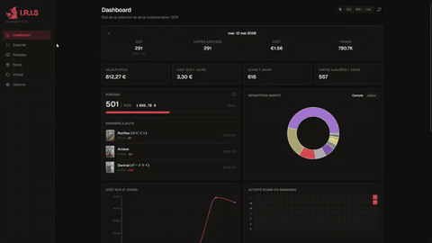
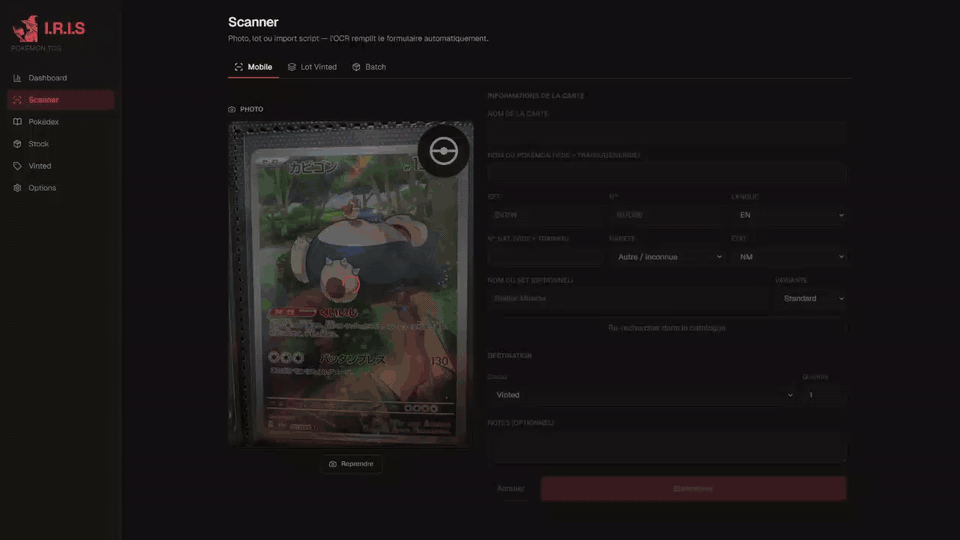
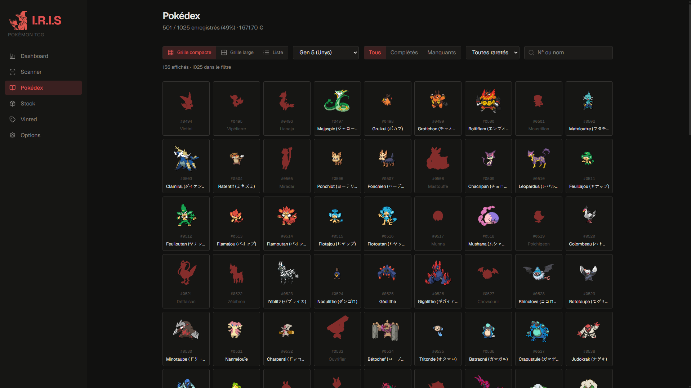
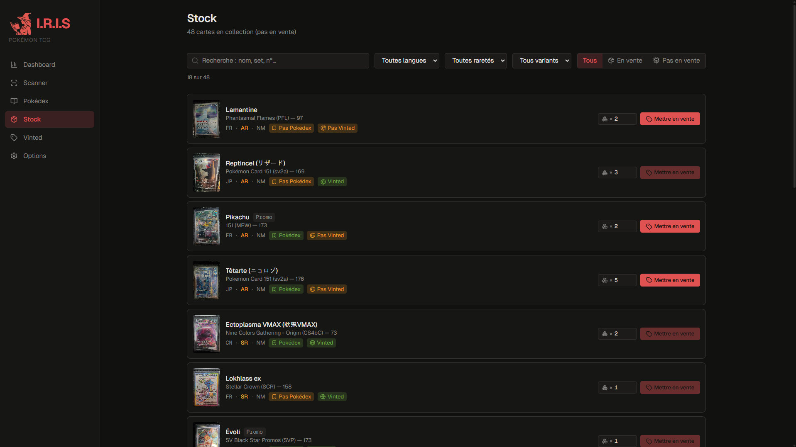
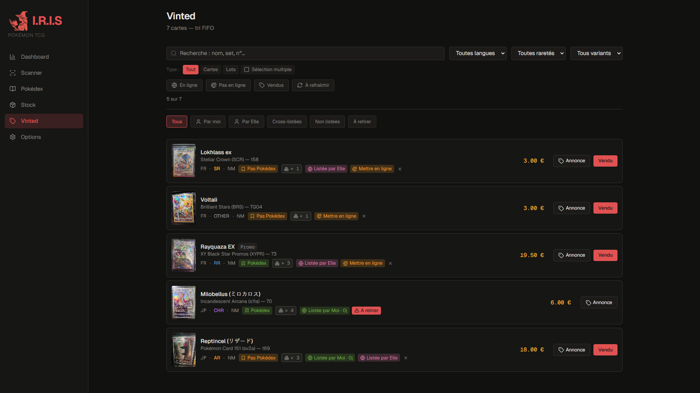
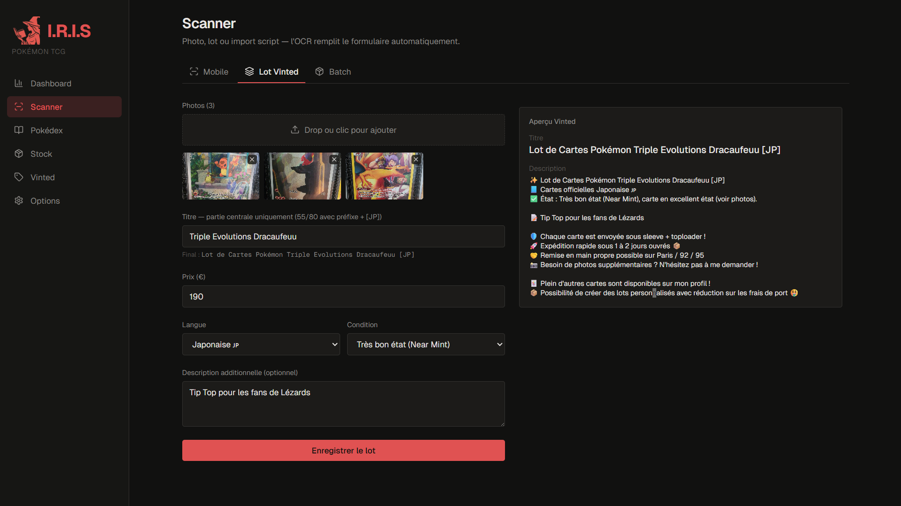
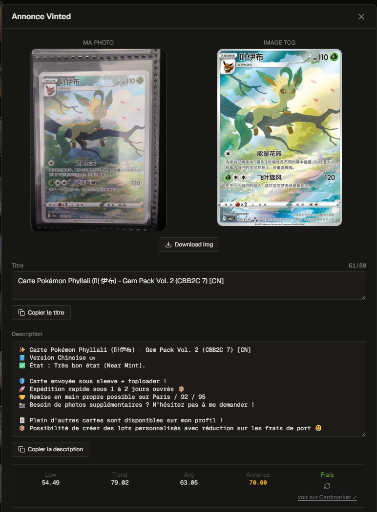
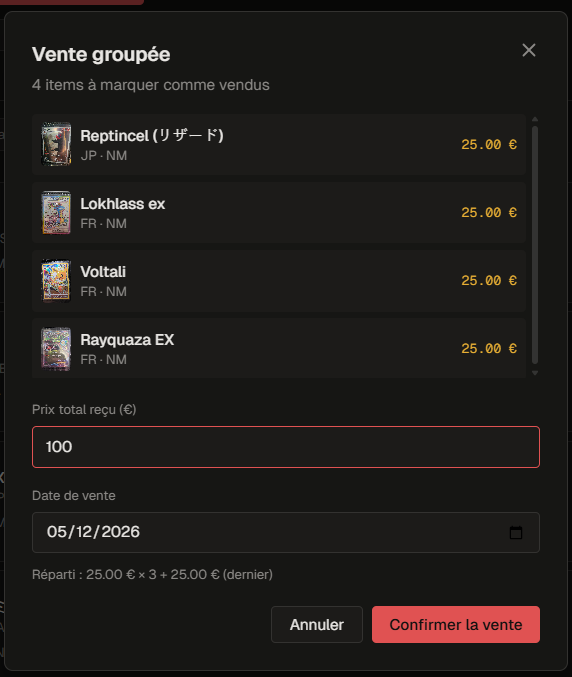
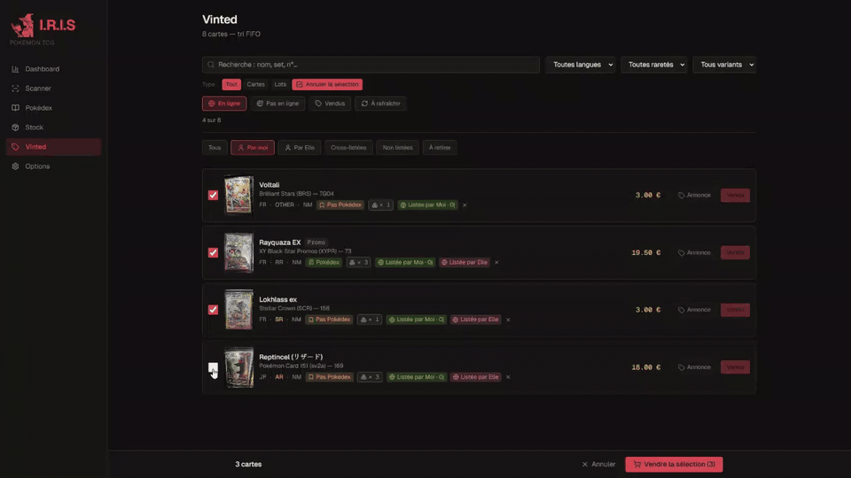
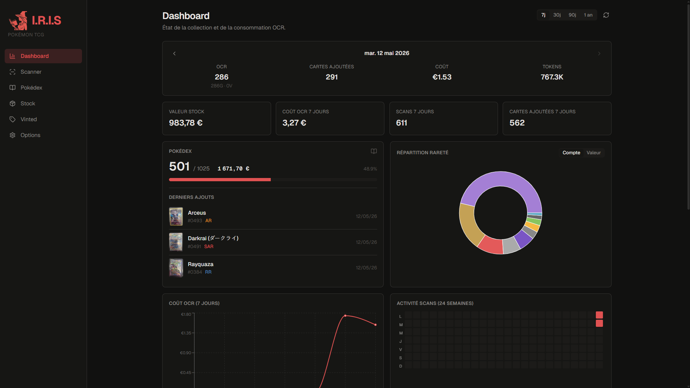

<div align="center">


# I.R.I.S

### Intelligent Recognition Inventory System

A two-collector PWA that scans, prices, and sells a shared Pokémon TCG collection — from camera to Vinted in three taps.

[](https://nextjs.org)
[](https://react.dev)
[](https://www.typescriptlang.org)
[](https://tailwindcss.com)
[](https://supabase.com)
[](#-testing)
[](#)

[The scan](#-it-starts-with-a-scan) · [The views](#-now-where-does-it-go) · [The sell](#-time-to-sell) · [The two of us](#-but-youre-not-alone) · [The control room](#-the-control-room) · [Under the hood](#-under-the-hood) · [Demo](#-see-it-in-action) · [Quick start](#-try-it-yourself) · [Docs](#-going-deeper)

</div>

---

## Two collectors, one shoebox of cards

A shared collection. Two Vinted accounts. Cards moving in and out, prices shifting daily, and the same nagging question every evening: *whose card is this, has it been listed, has it sold, at what price?*

That's why I built **I.R.I.S** — *Intelligent Recognition Inventory System*. Solo, over ~3 months. Used every day.

---

## 🎬 See it in action

A short tour of the daily flow — scan → enrich → Pokédex / Stock / Vinted → listing — in under a minute.

<p align="center">
  
  <br /><sub><em>End-to-end: scan → enrich → Pokédex / Stock / Vinted → listing</em></sub>
</p>

---

## 📷 It starts with a scan

You point your phone at a card. Three seconds later, I.R.I.S knows the name in two languages, the set, the rarity, the illustrator, and what it's worth on Cardmarket today.

The OCR runs on **Gemini 3.1 Flash Lite Preview** (~93 % accuracy, structured JSON in a single call) with **Google Vision** as automatic fallback. ~€0.0004 per scan, with photos downscaled to 1400 px max edge before upload to keep the token budget tight. Optimized for the five languages I collect — Japanese, English, French, Korean, Chinese — with bilingual name extraction for FR cards (`"Gruikui (チャオブー)"`). The OCR + database also accept DE / IT / ES / PT for the occasional foreign card. The prompt asks Gemini to read the printed `set_prefix` (3–4 letter code like BRS, LOR, BKR) directly off the card — short and unambiguous, so I don't need to ship a constraint list and the prompt stays under 300 tokens.

Once the card is identified, a **4-strategy enrichment pipeline** ([`app/api/enrich/route.ts`](app/api/enrich/route.ts)) fills in the rest. **Strategy 0** is a direct cardmarket lookup by `(set_prefix + set_number)` against the local `cardmarket_card_index` (~33K rows scraped via BrightData) — most cards land here in <50 ms with `cardmarket_id` attached. **Strategy 1** is a name-based picker: when the printed number is hard to OCR (TG/GG subseries, blurry digits) Gemini returns `set_number=null` and the pipeline surfaces every card in the expansion matching the Pokémon name (translated to English via the static dex map at [`lib/data/pokemon-names.json`](lib/data/pokemon-names.json)). **Strategy 2** is **TCGdex live** for cards not in the cardmarket dump. **Strategy 3** is the **Gemini-only fallback** — saves the bare OCR fields with no `cardmarket_id` so user can still record the card.

<p align="center">
  
  <br /><sub><em>Photo → Gemini OCR → catalog match → form prefill in ~3 s</em></sub>
</p>

---

## 🗂 Now, where does it go?

Every card lands in one of three places.

**Pokédex** — exactly one card per Pokémon, all 1 025 species. Three display modes (large grid, compact grid, list), search by number or name, and a swap-on-replace flow when promoting a card from Stock or Vinted.

**Stock** — the physical inventory mirror. Count chips for duplicate copies, instant clone button when you pull a second copy out of the binder.

**Vinted** — the for-sale pile. State chips (offline / online / stale / sold), bulk-sold flow with per-card price split, restock proposals, partner cleanup notices.

<p align="center">
  
  <br /><sub><em>Pokédex — large grid mode (1 of 3 display modes)</em></sub>
</p>

<p align="center">
  
  <br /><sub><em>Stock — count chips for duplicates, instant clone on second copy</em></sub>
</p>

<p align="center">
  
  <br /><sub><em>Vinted — state chips per card (offline / online / stale / sold), per-user identity colors</em></sub>
</p>

And when a single Vinted listing should bundle several cards, **Lots** ship a custom photo set + template description as one post.

<p align="center">
  
  <br /><sub><em>Lot builder — multi-card photo set + templated bilingual listing</em></sub>
</p>

---

## 💰 Time to sell

You don't price your cards. I.R.I.S does.

Cardmarket's official API closed to new applicants in 2023, so the pricing pipeline is bespoke. A daily mirror of their public S3 dumps (**~67K products + ~67K pricing rows**) lands in Postgres. The exact `(expansion, set_number) → idProduct` index is populated via **BrightData scraper** (`scrapers/cardmarket/`) that parses Cardmarket gallery pages for all 741 expansions (~$3 cost, 99.3% success rate). The historical SQL formula approach (documented in [docs/CARDMARKET_MAPPING.md](docs/CARDMARKET_MAPPING.md)) was found unreliable in practice and is kept only as a rapid-prototyping fallback. No fuzzy name guessing — every priced card carries a "View on Cardmarket ↗" deep link so the match is verifiable.

The listing generator turns a saved card into a ready-to-paste Vinted post: bilingual title (smart-truncated to 80 chars), templated description with shipping block, copy-to-clipboard button, downloadable card image (PNG, anti-bot watermark stripped). When a customer buys several cards at once, the bulk-sold flow splits the total across them automatically.

<table width="100%">
  <thead>
    <tr>
      <th width="50%">Listing</th>
      <th width="50%">Bulk sold</th>
    </tr>
  </thead>
  <tbody>
    <tr>
      <td></td>
      <td></td>
    </tr>
  </tbody>
</table>

<p align="center">
  
  <br /><sub><em>Bulk sell — pick cards, split total price, propagate sold state across both accounts</em></sub>
</p>

---

## 👥 But I'm not alone

My partner has her own Vinted account. The collection is shared. The listings are not.

Under the hood, `cards` and `lots` are shared rows that both users read. `card_listings` and `lot_listings` are per-user rows protected by **Postgres Row-Level Security scoped to `auth.uid()`** — only the owner can write their own listing state. Each user gets a distinct identity color across the UI (badges, action labels), so it's always obvious who's selling what.

When I mark my partner's listing as sold, I.R.I.S runs a cleanup pass: the listing is taken down, an optional restock proposal chains correctly across both accounts, and a partner-cleanup notice fires if the same card was also up on the other side.

---

## 📊 The control room

At the end of the day, you want the whole picture.

The Dashboard answers in one screen. A period selector (7 d / 30 d / 90 d / 1 y) drives **4 KPI tiles** — stock value, OCR cost, scans, cards added — alongside a today-in-context block. Below: pokédex progress with the latest captures, a rarity drill-down donut, a daily-cost stacked bar, a custom-SVG 24-week scan heatmap (the rest powered by Recharts), the top 10 rares, and the last 10 sales. Every list deep-links into the card drawer.

Behind the scenes, a **daily Vercel cron** refreshes Cardmarket pricing nightly. A **daily GitHub Actions cron** snapshots the database to gzipped releases — rotation 30 daily / 12 weekly / 12 monthly. One-click manual backups from the Options page push gzipped dumps to a Supabase bucket with signed-URL download.

And the whole thing installs as a PWA — manifest plus maskable icons, auto-show install banner on Chrome/Edge/Android, illustrated 3-step modal for iOS Safari.

<p align="center">
  
  <br /><sub><em>Dashboard — KPIs, Pokédex progress, rarity drill-down, scan heatmap, top rares, last sales</em></sub>
</p>

---

## 🛠 Under the hood

Here's what's holding it all together.

| Layer | Choice | Why |
|---|---|---|
| **Framework** | Next.js 16 (App Router) | Server components for data-loading pages, edge runtime where it matters, file-system routing. |
| **Language** | TypeScript (strict) | End-to-end type safety, including the database via Supabase generated types. |
| **i18n** | next-intl with cookie-based locale (en/fr/ja/zh, EN default) | No URL changes, language toggle in Options. |
| **UI** | React 19 + Tailwind v4 | Tailwind v4 uses `@theme` in CSS (no JS config). Lucide icons. |
| **Database** | Supabase (Postgres + Storage + Auth + RLS) | Managed Postgres with first-class RLS, S3-compatible Storage for card photos, magic-link/password auth out of the box. |
| **OCR** | Gemini 3.1 Flash Lite Preview (primary), Google Vision (fallback) | Gemini extracts structured JSON in one call (vs Vision's raw text + regex). 93 % accuracy bench-validated. |
| **Catalog source** | LimitlessTCG (scraper) | Cardmarket API closed to new applicants in 2023; LimitlessTCG's robots.txt allows scraping with delays. |
| **Pricing source** | Cardmarket S3 dumps + BrightData-scraped index | Public dumps refreshed daily; `cardmarket_card_index` populated via BrightData scraper (`scrapers/cardmarket/`) parsing gallery pages for exact `(set, number) → idProduct` mappings. |
| **Hosting** | Vercel (app + cron) + Supabase (DB + storage) | Both have generous free tiers; Vercel's preview deployments and edge cron are first-class. |
| **Testing** | Vitest + happy-dom | Fast pure-function tests for the helpers; React Testing Library for components. |

A few architectural choices worth calling out:

- **Server components for pages, client components for interactivity.** Pages do parallel Supabase queries server-side; rows and modals are client components that hit API routes for mutations.
- **Per-user RLS, shared inventory.** `cards` / `lots` are readable by both users; `card_listings` / `lot_listings` are writable only by their owner. The "who listed it" identity is computed at render time.
- **Helpers are pure.** All logic that doesn't need React or Supabase lives in [`lib/utils/`](lib/utils/) — ~24 modules, all unit-tested. Components consume helpers; no business logic in JSX.
- **Cardmarket-first enrichment.** Strategy 0 checks the local `cardmarket_card_index` first (<50ms); when that misses, local `tcg_catalog` (52K cards); TCGdex is the network fallback only when both local sources miss.
- **Cardmarket pricing without the API.** Public S3 dumps + BrightData scraper populate the `(set, number) → idProduct` index. Exact matches, no name fuzzing. The historical SQL formula approach is documented in [docs/CARDMARKET_MAPPING.md](docs/CARDMARKET_MAPPING.md) but was found unreliable in practice.

Full code map in **[docs/ARCHITECTURE.md](docs/ARCHITECTURE.md)**.

---

## 🚀 Try it yourself

```bash
git clone https://github.com/<you>/iris.git && cd iris
nvm use 22 && npm install
cp .env.example .env.local                          # fill in keys — see docs/SETUP.md
npx supabase link --project-ref <ref> && npx supabase db push
npx tsx scripts/scrape-limitlesstcg.ts              # ~12 min, populates the offline catalog
npx tsx scripts/scrape-cardmarket-expansion-names.ts  # 1-shot name_en/name_ja for expansions
npm run dev                                         # → http://localhost:3000
```

The full setup walkthrough — Supabase provisioning, Google Vision and Gemini keys, Vercel cron, WSL2 SSL gotchas — lives in **[docs/SETUP.md](docs/SETUP.md)**.

---

## 📚 Going deeper

| Doc | What you'll find |
|---|---|
| **[docs/ARCHITECTURE.md](docs/ARCHITECTURE.md)** | The code map — directory structure, key abstractions, data flow. Start here for code understanding. |
| **[docs/FEATURES.md](docs/FEATURES.md)** | The full feature catalog with edge cases. The "what does it actually do?" reference. |
| **[docs/TECH_DEBT.md](docs/TECH_DEBT.md)** | The honest list — what's not perfect, why it was deferred, what it would take to fix. |
| **[docs/CHANGELOG.md](docs/CHANGELOG.md)** | Phase-by-phase build history with what shipped and why. |
| **[docs/SETUP.md](docs/SETUP.md)** | Every key, every command, every WSL2 gotcha. Start here if you want to run it. |
| **[docs/SUPABASE.md](docs/SUPABASE.md)** | Database schema, migrations, RLS policies, storage buckets, reset-from-scratch procedure. |
| **[docs/COMMANDS.md](docs/COMMANDS.md)** | Every npm script and `tsx` script in the repo, with usage and intent. |

---

## 🧪 Testing

```bash
npm test              # run once
npm run test:watch    # watch mode
npm run typecheck     # tsc --noEmit
npm run lint          # ESLint
npm run format        # Prettier --write
```

UI components are thin wrappers around ~34 pure helper modules in [`lib/utils/`](lib/utils/) — that's where the logic and the tests live. **449 tests, zero lint warnings, zero type errors.**

---

## 🗺 What's next

- Backup of card photos to a separate Storage bucket (currently inline in the cards table).
- UI for restoring from a manual backup snapshot.

---

## 🧾 Honest tech debt

Every shipped feature has trade-offs. The 1,445-line `CardScanForm` that earns its size, the 8 ad-hoc modals waiting on a primitive migration, the heuristic Cardmarket disambig that handles 95 % of cases — each one passed a deliberate cost-benefit check, and each one is documented.

The full catalog — what's deferred, why, and what it would take to fix — lives in **[docs/TECH_DEBT.md](docs/TECH_DEBT.md)**. It's the answer to *"what would you fix if you had another two weeks?"* — and the implicit answer to *"do you know when to stop?"*.

---

## 📄 License

This is a personal project. Source code is provided as-is for portfolio and learning purposes. No license is granted for commercial use or redistribution.

---

<div align="center">

Built with curiosity, far too much coffee, and a lot of Pokémon cards.

</div>
