<div align="center">


# I.R.I.S

### Intelligent Recognition Inventory System

The app two collectors run a shared Pokémon card collection on: it scans, prices from Cardmarket, posts to Vinted on a schedule, and keeps score of my PTCG Live games.

[](https://nextjs.org)
[](https://react.dev)
[](https://www.typescriptlang.org)
[](https://supabase.com)
[](vinted-agent/README.md)
[](#-testing)
[](#-watching-the-numbers)

[The scan](#-it-starts-with-a-scan) · [The binder](#-now-where-does-it-go) · [The sell](#-time-to-sell) · [The bot](#-then-the-bot-takes-over) · [The numbers](#-watching-the-numbers) · [The game](#-and-on-weekends-i-play) · [Under the hood](#-under-the-hood) · [What I learned](#-what-i-learned) · [Demo](#-see-it-in-action) · [Quick start](#-try-it-yourself)

</div>

---

## Two collectors, one shoebox of cards

A shared collection. Two Vinted accounts. Cards going in and out, prices moving every day, and the same question every evening: *whose card is this, is it listed, has it sold, and for how much?*

It started as a scanner and an inventory. Then listing cards on Vinted by hand turned into an evening job, so a bot took it over. Then I started playing Pokémon TCG Live seriously, and the same app now keeps my battle logs, my stats and my tournaments.

That's why I built **I.R.I.S** — *Intelligent Recognition Inventory System*. Solo, from April to October 2026, with Claude Code as a pair programmer. We use it every day: 2,126 cards have gone through it so far.

---

## 🎬 See it in action

A morning lap: the dashboard from top to bottom, then the Pokédex, the cards on Vinted, the bot's queue and my game stats.

<p align="center">
  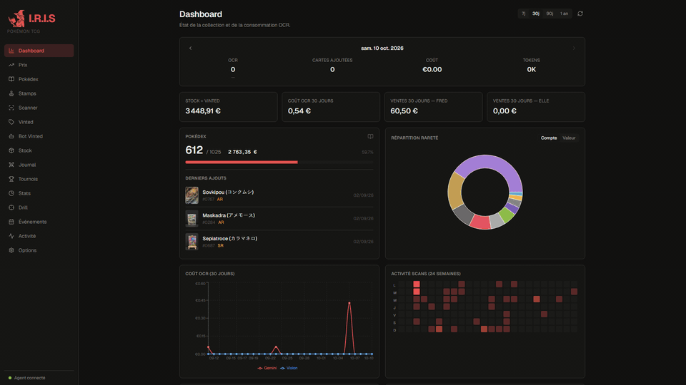
  <br /><sub><em>Dashboard → Pokédex → Vinted → Vinted bot → PTCG Live stats</em></sub>
</p>

Every visual here is recorded by a script against a local copy of the app: a throwaway Supabase built from the project's migrations and seeded with a sanitized snapshot of our data (fake Vinted ids, renamed opponents, catalog images in place of most of my photos). The UI is in French, the language we use it in. The recipe is in [SHOWCASE/capture/](SHOWCASE/capture/).

---

## 📷 It starts with a scan

I drop a stack of photos, or shoot them one after another with the phone. A few seconds later each card is identified, matched to its Cardmarket product, and waiting for one tap.

The batch scanner ([`components/submit/BatchForm.tsx`](components/submit/BatchForm.tsx)) takes up to **30 photos**, or a chain capture from the rear camera with a card-shaped guide. Each photo is downscaled in the browser to 1,400 px before upload: a comment in [`lib/utils/resize-image.ts`](lib/utils/resize-image.ts) records that 1,024 px lost 8 cards out of 30 and 1,600 px cost about 25 % more image tokens. Five workers then run in parallel, a bound set by Gemini's Tier 1 quota of 15 requests a minute.

The OCR is one call to **Gemini 3.1 Flash Lite** with a JSON schema ([`lib/api/gemini-vision.ts`](lib/api/gemini-vision.ts)): card name, Pokémon, the printed set code, number, language, rarity and a confidence, at temperature 0 with no thinking budget. **Google Vision** is the fallback, with word-box heuristics to find the number in the bottom-left corner. Every call lands in `ocr_usage_log` with its tokens and its cost: **2,108 scans since May, €11.27 in total, about €0.005 each**, and Vision had to step in twice. The Pokédex number is treated as ground truth: Gemini's name translations are overwritten from a static 1,025-entry French/English/Japanese table generated from PokéAPI ([`lib/data/pokemon-names.json`](lib/data/pokemon-names.json)), because it once called dex #3 "Abo".

Then a **four-strategy enrichment** ([`app/api/enrich/route.ts`](app/api/enrich/route.ts)) finds the exact product:

- **Strategy 0** rests on one observation: the set code printed on the card (BRS, LOR, SV2a) is also the prefix of Cardmarket's image URLs. Prefix + number go through `cardmarket_expansions` and the **48,699-row** `cardmarket_card_index` to the product, and a self-check rejects a hit whose English name does not contain the species the OCR read.
- **Strategy 1** handles numbers the OCR can't read (TG and GG subsets): a picker of every product in that set matching the English name, with its suffix (ex, V, VMAX…).
- **Strategy 2** asks **TCGdex** live, including printed codes TCGdex doesn't index: `30C` maps to two TCGdex sets, and Classic Collection reprints are found by name because they keep their original number.
- **Strategy 3** keeps Gemini's fields alone, so the card can still be saved and priced later.

<p align="center">
  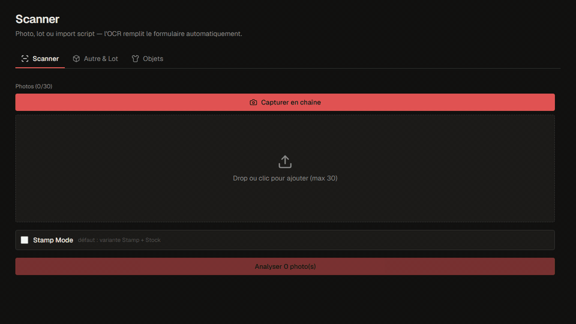
  <br /><sub><em>Three photos → Gemini OCR → Cardmarket match → review → saved, one tap per card</em></sub>
</p>

The review form ([`components/submit/CardScanForm.tsx`](components/submit/CardScanForm.tsx)) puts my photo, with a magnifier loupe, next to the matched catalog image and the Pokémon's sprite. It shows the OCR confidence, the engine with its tokens and cost, and a Pokédex suggestion that compares rarity ranks with the card already in that slot. Saving goes through one bulk insert ([`app/api/cards/batch/route.ts`](app/api/cards/batch/route.ts)), and the database itself refuses a second Pokédex card for a species or a second copy for sale of the same card (partial unique indexes). The server checks the same rules first and answers a 409 that the form offers to resolve: keep the existing photo, swap the Pokédex card, or send the copy to Stock.

<p align="center">
  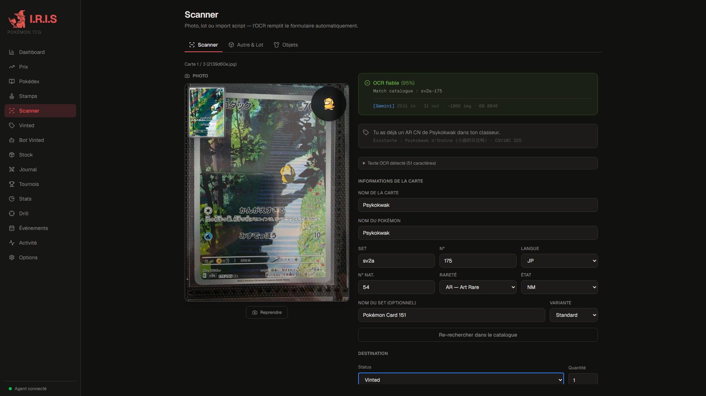
  <br /><sub><em>The review: catalog match, OCR confidence and cost, and the Pokédex suggestion for that species</em></sub>
</p>

**Also in the box**

<table width="100%">
  <tr>
    <td width="50%">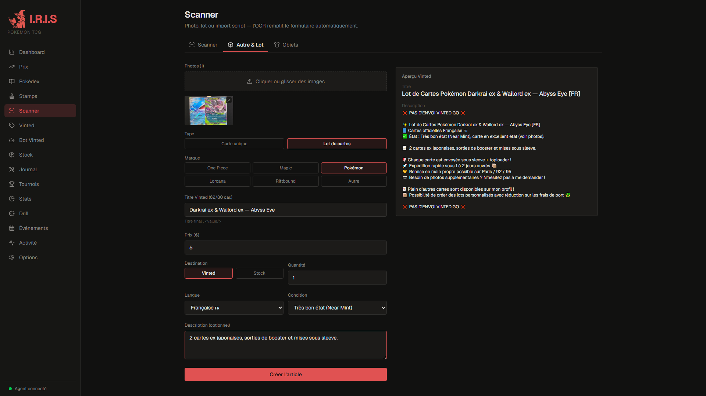<br /><sub><em>« Autre & Lot »: a lot or a single from any game, its Vinted listing written as I type</em></sub></td>
    <td width="50%">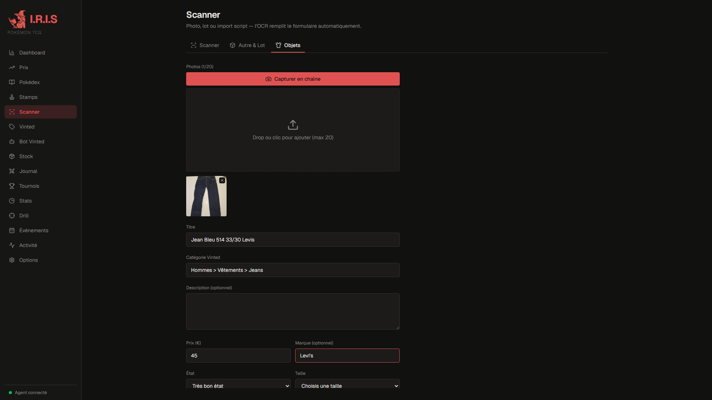<br /><sub><em>« Objets »: anything else, in one of 2,920 Vinted categories with that category's sizes</em></sub></td>
  </tr>
</table>

Every card then lands in one of three places.

---

## 🗂 Now, where does it go?

The **Pokédex** keeps exactly one card per species: 1,025 slots, 612 of them filled. The **Stock** is the binder: every other copy I own. **Vinted** is the pile for sale.

The Pokédex grid ([`components/pokedex/PokedexGrid.tsx`](components/pokedex/PokedexGrid.tsx)) has three display modes, filters by generation, status and rarity, and a search by number or name; the empty slots are red silhouettes. A slot opens a drawer with my photo next to the catalog image, the Cardmarket prices with their trend arrow, and the price history. When a better copy turns up, the swap is one SQL function ([`replace_pokedex_card`](supabase/migrations/20260430200000_fix_replace_pokedex_card_3step.sql)) in three steps: park the old card in Stock, promote the new one, then move the old one where it belongs. In that order the two unique indexes never collide.

<p align="center">
  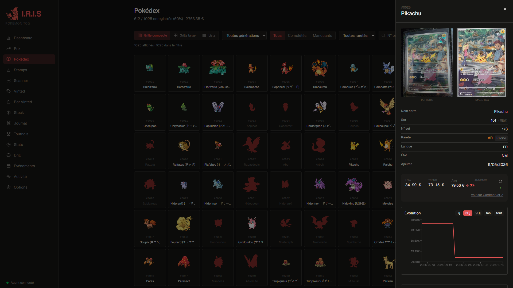
  <br /><sub><em>Pokédex: 612 of 1,025 species, and the drawer of a slot with my photo, the catalog image and the price history</em></sub>
</p>

The Stock groups copies by identity: set, number, language, condition and variant ([`lib/utils/group-cards.ts`](lib/utils/group-cards.ts)). Each group gets a count chip that clones or trims copies, badges telling whether the species is in the Pokédex and whether a copy is for sale, and a button to put one up for sale. Cards that leave through a trade instead of a sale are recorded too, with a date and a photo of the exchange. Stamped promos have their own showroom: the scanner's Stamp mode files them straight into Stock, and the automatic pricing skips them, so they keep the price I set by hand.

<table width="100%">
  <thead><tr><th width="50%">Stock</th><th width="50%">Stamps</th></tr></thead>
  <tbody><tr>
    <td>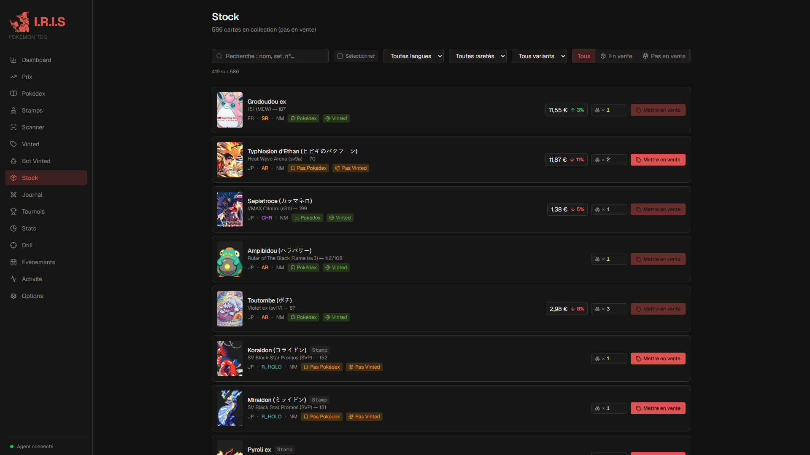</td>
    <td>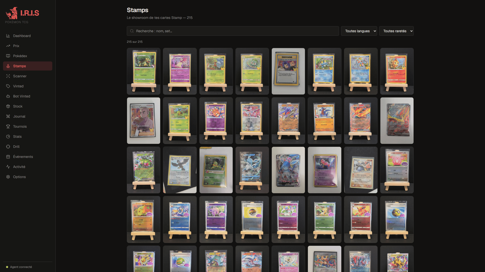</td>
  </tr></tbody>
</table>

---

## 💰 Time to sell

I don't price the cards; I.R.I.S does. I don't write the listings either.

Two people sell from the same pile with their own accounts. `cards` and `lots` are shared rows; `card_listings` and `lot_listings` are per-user rows protected by **row-level security on `auth.uid()`**, so each of us writes only our own listing state. The partner's listings show in her colour, and the filters answer the evening question directly: listed by me, by her, by both, by nobody, or still up although the card has sold. A listing turns « À rafraîchir » (stale) after **21 days** ([`lib/utils/listing-stale.ts`](lib/utils/listing-stale.ts)).

<p align="center">
  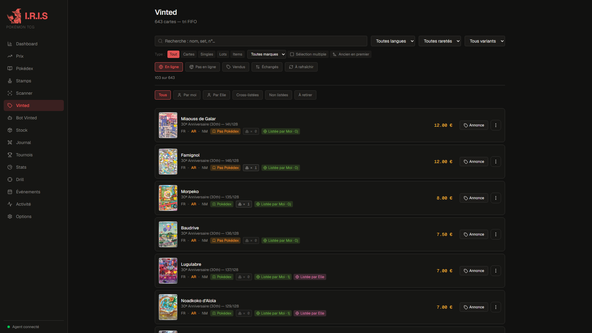
  <br /><sub><em>Vinted: the listings that are up, who posted each one and when, and the cards listed on both accounts</em></sub>
</p>

The asking price starts at **0.85 × the Cardmarket trend** ([`lib/constants/pricing.ts`](lib/constants/pricing.ts)). That is only a suggestion: the bot posts a card only once one of us has confirmed its price. The listing text comes from a template ([`lib/utils/vinted-template.ts`](lib/utils/vinted-template.ts)). The title must fit Vinted's 80 characters, so a six-step ladder drops the bilingual name, then the "Carte Pokémon" prefix, then swaps the set name for its code, until it fits. The description says which language version the card is and in what condition, and carries the shipping block and a "PAS D'ENVOI VINTED GO" line at both ends, so it survives truncation.

A sale stamps who sold the card and checks what's left. If a Stock copy exists, it is offered up for sale and the live listings move to it; if nothing is left but the Pokédex copy, a notice says so. If the partner had the same card listed, her listing gets a delete job. A bundle sold to one buyer takes a single total, split in cents across the cards with the remainder on the last one ([`lib/utils/split-bulk-price.ts`](lib/utils/split-bulk-price.ts)).

<table width="100%">
  <thead><tr><th width="50%">The listing</th><th width="50%">A bundle sale</th></tr></thead>
  <tbody><tr>
    <td>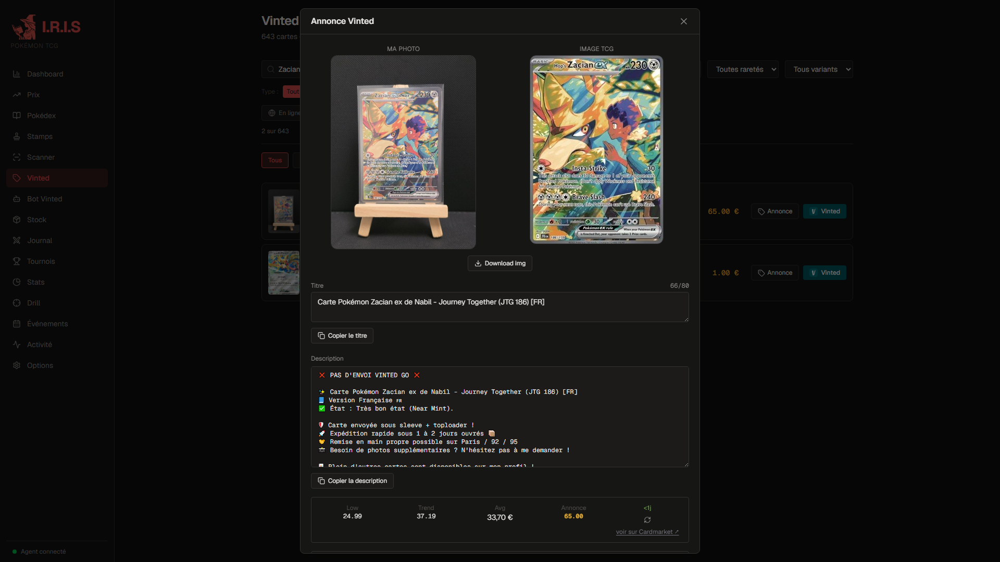</td>
    <td>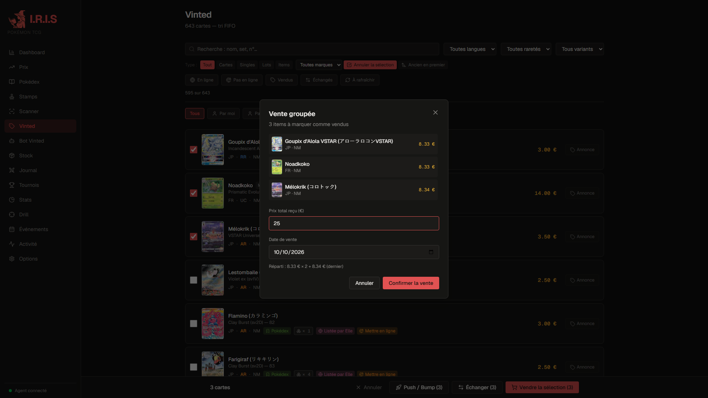</td>
  </tr></tbody>
</table>

**Also in the box**

<table width="100%">
  <tr>
    <td width="50%">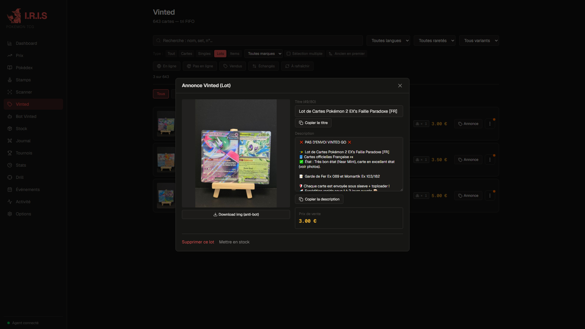<br /><sub><em>Lots for any game (Pokémon, Lorcana, One Piece, Magic, Riftbound), with a photo carousel and a quantity that splits on sale</em></sub></td>
    <td width="50%">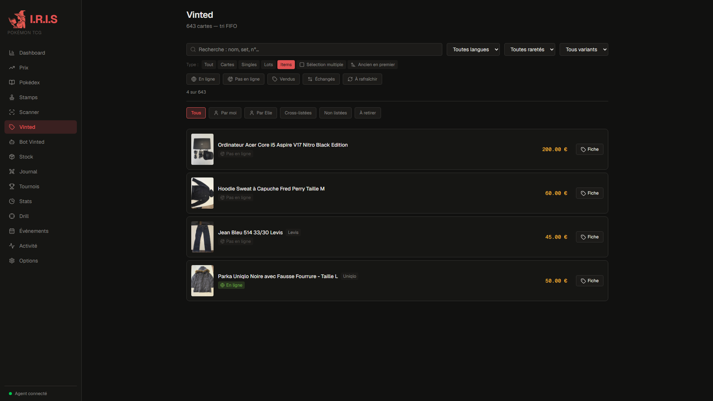<br /><sub><em>Items: everything that isn't a card, on one account only, invisible to the other by RLS</em></sub></td>
  </tr>
</table>

---

## 🤖 Then the bot takes over

Posting twenty listings a day by hand is an evening gone. So a bot posts them, inside time windows I set, at a pace a person could keep.

The bot is a separate **Python asyncio agent** ([`vinted-agent/main.py`](vinted-agent/main.py)) running on my own machine. It talks to Vinted's web API with each account's session, the way the site itself does, and it never opens a port. The app and the agent never call each other: **the database is the message bus**. A job is a row in `vinted_post_jobs`, written by the app for a manual post or by the agent's own scheduler; the agent hears it through Supabase Realtime and claims it with a conditional update (`pending` → `processing`), so a job runs once. It also runs only one Vinted session at a time across both accounts. Each post waits 8–20 s before uploading, 4–10 s between photos and 10–20 s before publishing, then cools down for 45–90 s, success or failure.

The schedule lives in [`vinted-agent/scheduler.py`](vinted-agent/scheduler.py). Every five minutes, inside a window and under the daily quota, it posts the next item in the queue, in the group order shown on the page, or reposts a listing older than 14 days. A tick fires with probability `min(1, 300 s ÷ time left in the window)`, so posts spread across the window instead of bunching at its start. The decision is a pure function with its random draw passed in, which is what lets 30 tests pin it down. Since June the agent has run **1,743 jobs: 1,396 posts and 344 reposts, 97.9 % of them successful**.

<p align="center">
  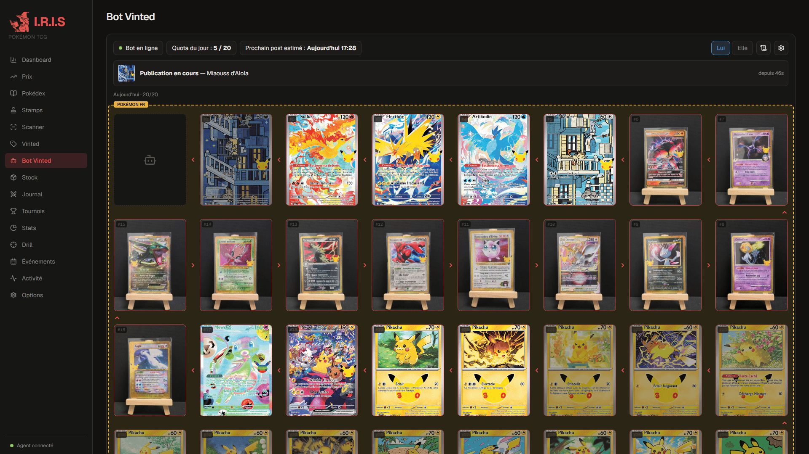
  <br /><sub><em>The bot page: agent online, today's quota, the job in progress, and the queue grouped by language and brand</em></sub>
</p>

The page ([`components/vinted/monitoring/`](components/vinted/monitoring/)) shows whether the agent is alive (a heartbeat under 90 s old), the quota of the day, the next window and the job in progress. The queue is a snake-shaped grid with one frame per group (Pokémon FR, Pokémon JP, Lorcana, Items…): drag cards to reorder, then save once. Below it, the repost pool can be reordered the same way. Settings hold the quota, the repost delay, the group priority and separate weekday and weekend windows.

**Also in the box**

<table width="100%">
  <tr>
    <td width="50%">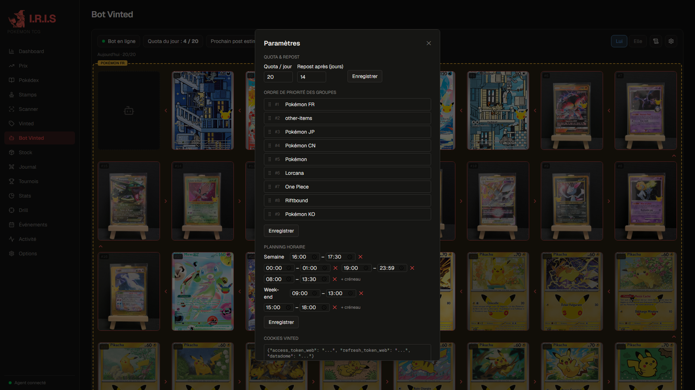<br /><sub><em>Quota, repost delay, group priority and the weekday / weekend windows</em></sub></td>
    <td width="50%">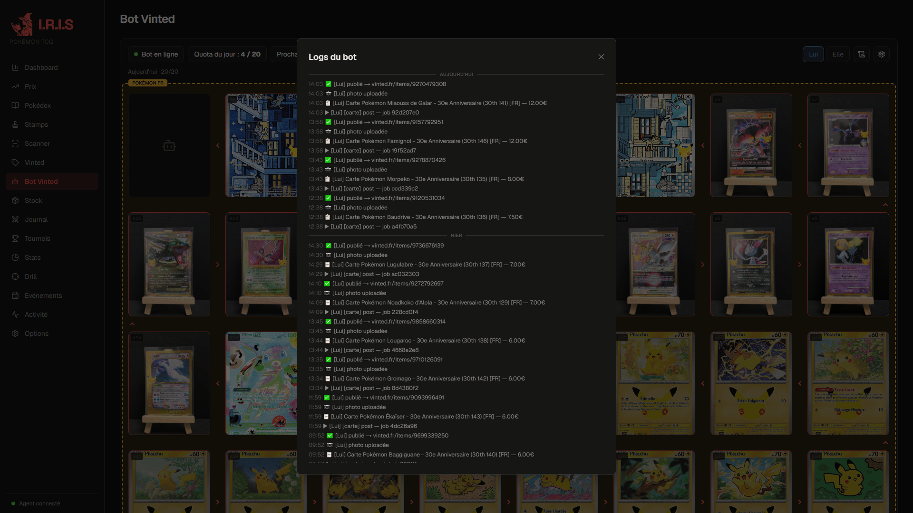<br /><sub><em>The agent's log, mirrored to Supabase line by line</em></sub></td>
  </tr>
</table>

---

## 📈 Watching the numbers

A Cardmarket snapshot tells you what a card is worth today. It doesn't tell you whether it has been climbing for a month, or what the whole collection is worth.

Cardmarket's API is closed to new applicants, so the pricing pipeline is my own. Every night a GitHub Action mirrors Cardmarket's public dumps (**69,197 products** and their prices) into Postgres. The (set, number) → product index was scraped from Cardmarket's own gallery pages, through BrightData ([`scrapers/cardmarket/`](scrapers/cardmarket/)). Three times a day a Vercel cron refreshes the 700 cards priced longest ago ([`app/api/prices/update/route.ts`](app/api/prices/update/route.ts)), trusting a stored product id first so two prints of the same card never swap. A nightly snapshot then writes every priced card into `price_history`: **117,260 rows for 1,529 cards since May**. On Sundays a `pg_cron` job folds days older than 90 into weekly medians, and weeks older than a year into monthly ones ([migration](supabase/migrations/20260513000000_price_history.sql)), so the table stays bounded.

Every price chip carries a trend arrow ([`lib/utils/price-trend.ts`](lib/utils/price-trend.ts)). It compares today with 1, 3, 7, 30 and 90 days ago (±2 days), in that order, and shows the first move of at least 0.5 %. The `/prices` page charts the value of the collection, lists the top movers, and puts every card in a virtualized list with a sparkline. A click opens the card's history with min, max, median, volatility and the change over 7, 30 and 90 days.

<table width="100%">
  <thead><tr><th width="50%">Prices</th><th width="50%">One card's history</th></tr></thead>
  <tbody><tr>
    <td>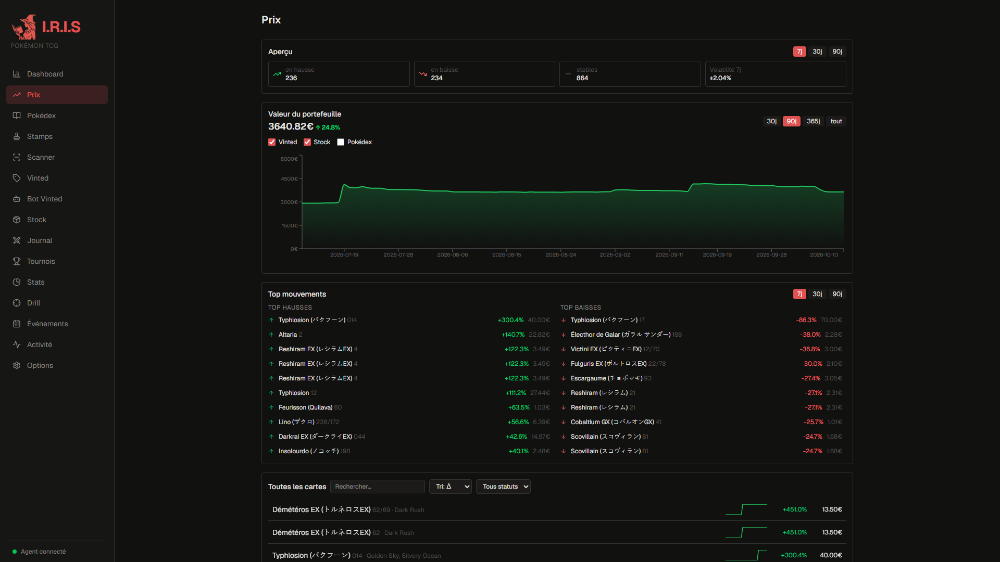</td>
    <td>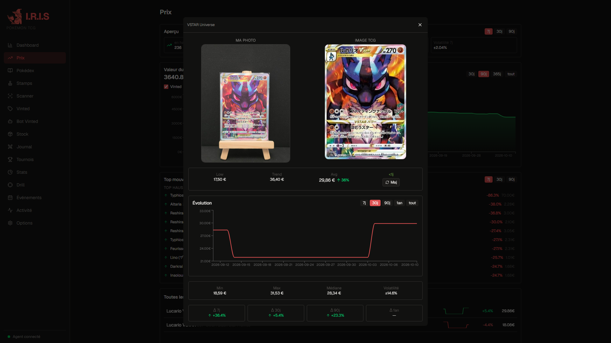</td>
  </tr></tbody>
</table>

The dashboard answers the rest in one screen ([`app/(app)/dashboard/page.tsx`](app/(app)/dashboard/page.tsx)), from eleven queries run in parallel. A day-by-day navigator shows scans, cards added, OCR cost and tokens. Below it sit the value of the stock, the OCR cost over the period, sales per seller, Pokédex progress, and a rarity donut whose slices open the Pokédex filtered on that rarity. Then the OCR cost per day, a 24-week scan heatmap drawn in plain SVG, the latest sales, the top 10 rares, and what went up on Vinted today. The unbounded queries go through [`fetchAllRows`](lib/api/fetch-all.ts), because Supabase answers at most 1,000 rows per request.

<p align="center">
  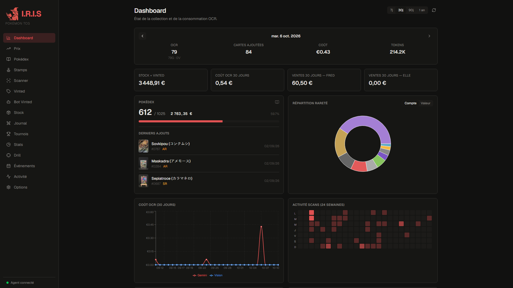
  <br /><sub><em>Dashboard: one day in detail, the KPIs, Pokédex progress, rarity breakdown, OCR cost and 24 weeks of scans</em></sub>
</p>

**Also in the box**

<table width="100%">
  <tr>
    <td width="33%">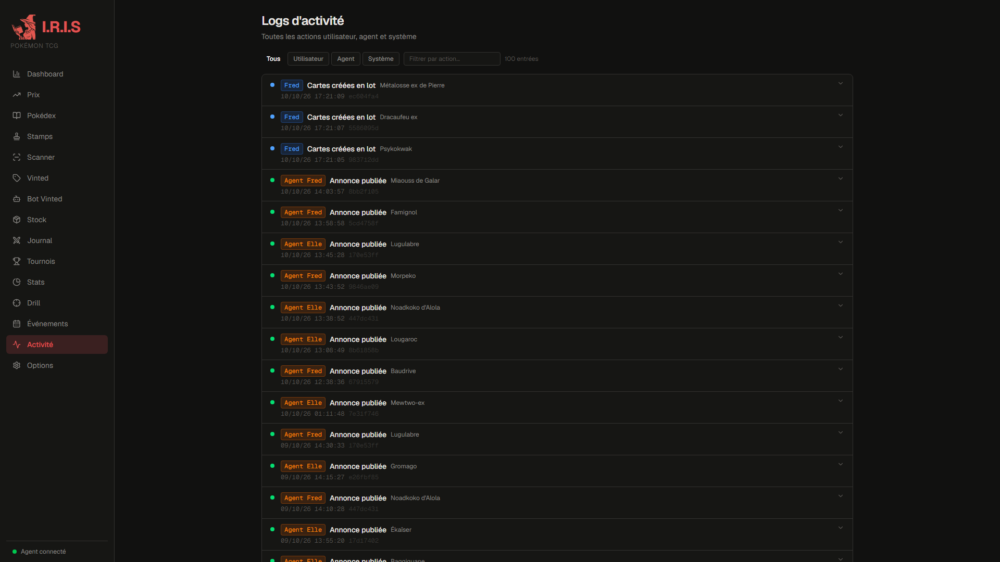<br /><sub><em>Activité: every action by a user, the agent or the system, with its details</em></sub></td>
    <td width="33%">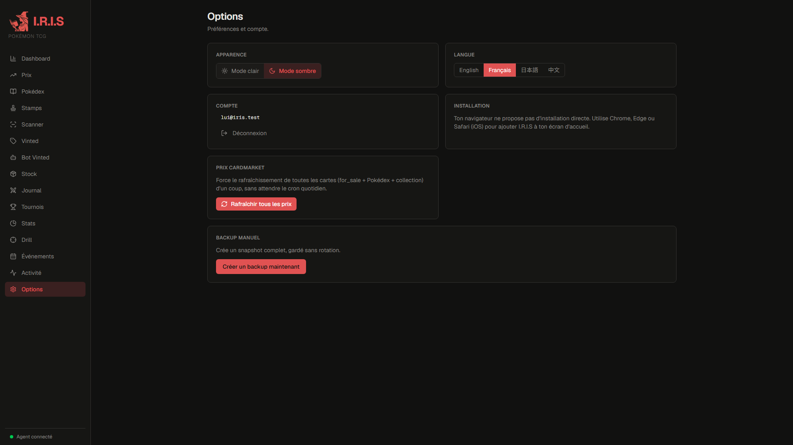<br /><sub><em>Options: theme, language, install, refresh every price, back up the database</em></sub></td>
    <td width="33%">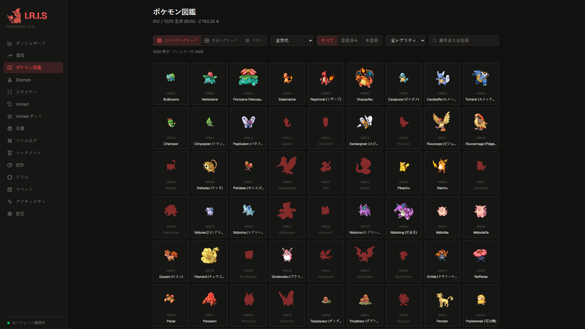<br /><sub><em>Four languages (French, English, Japanese, Chinese) from a cookie, no URL prefix</em></sub></td>
  </tr>
</table>

It installs as a PWA, and the phone is where the scanning happens: the scanner and Vinted sit in a bottom bar, and a Pokéball opens every other page.

<table width="100%">
  <tr>
    <td width="33%">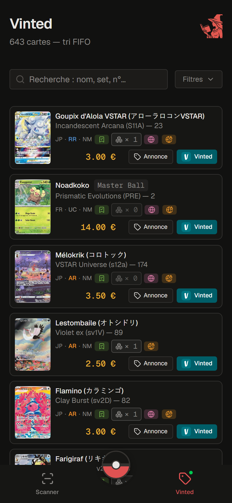</td>
    <td width="33%">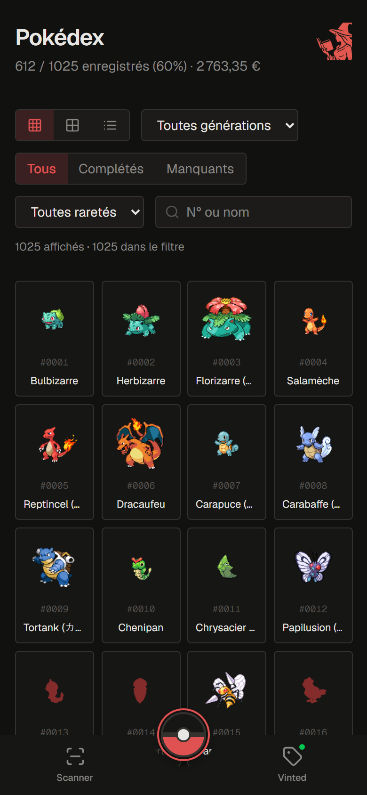</td>
    <td width="33%">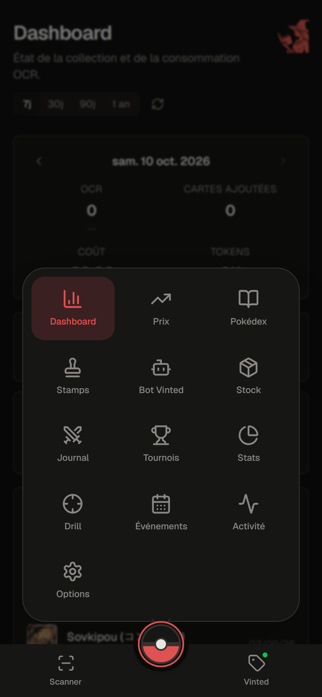</td>
  </tr>
</table>

---

## 🃏 And on weekends, I play

I also play the game. Pokémon TCG Live exports a full text log of every match, and I.R.I.S turns those logs into a record I can learn from.

Pasting a log runs the parser in [`lib/ptcg/`](lib/ptcg/). It tokenizes the French log line by line, rebuilds a board-state snapshot after every event, and checks the result against the log's own damage breakdowns ([`lib/ptcg/validate.ts`](lib/ptcg/validate.ts)): an effect it doesn't model is reported as unchecked, never as passed. From that it knows who exported the log, who won, the prizes taken, who went first, and each side's deck, read from the two Pokémon that dealt the most damage. A modal lets me confirm the decks, and every game keeps its turn-by-turn transcript. **161 games since mid-September, 99 of them won.**

<p align="center">
  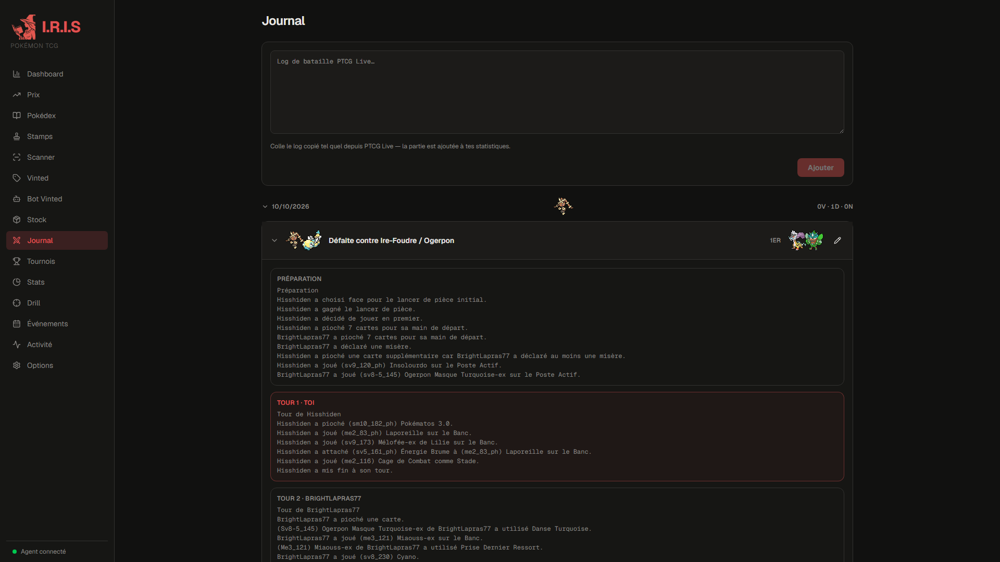
  <br /><sub><em>Battle logs grouped by day, and one game's transcript turn by turn (opponents renamed)</em></sub>
</p>

The stats are recomputed from every raw log each time the page renders ([`lib/ptcg/game-stats.ts`](lib/ptcg/game-stats.ts)), so a parser fix or a new deck rule applies to old games without a backfill. They drill down from my decks, to each matchup with its win rate going first and second, to nine sections: mulligans and openings, setup speed, Supporters per turn, cards drawn, prizes and KOs, attackers and card usage. Tournaments add their rounds (Bo1 or Bo3, byes and intentional draws), and the Drill trains prize checking: the decklist is shuffled, six prizes are hidden, and I have 45 seconds to work out which of my key cards are among them. Outside the app, a Claude Code skill ([`.claude/skills/ptcg-coach/`](.claude/skills/ptcg-coach/)) reads a digest of a game and writes the debrief.

<table width="100%">
  <thead><tr><th width="50%">Stats for one deck</th><th width="50%">A tournament</th></tr></thead>
  <tbody><tr>
    <td>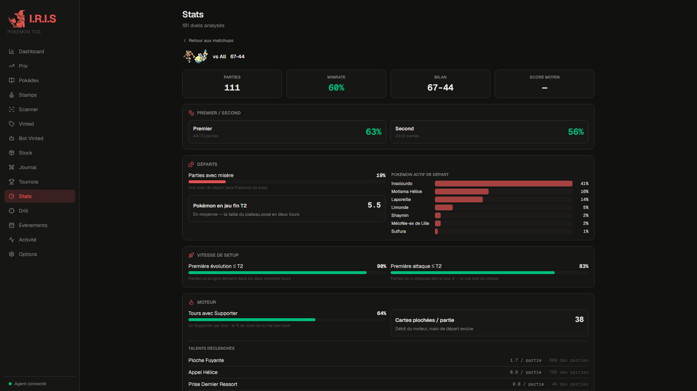</td>
    <td>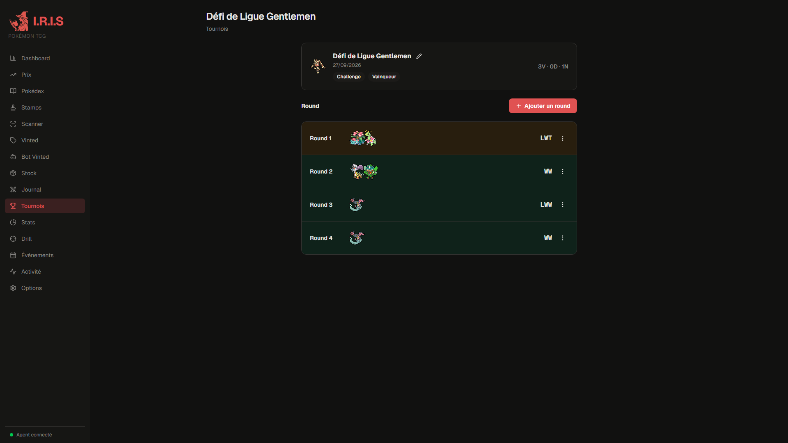</td>
  </tr></tbody>
</table>

**Also in the box**

<table width="100%">
  <tr>
    <td width="50%">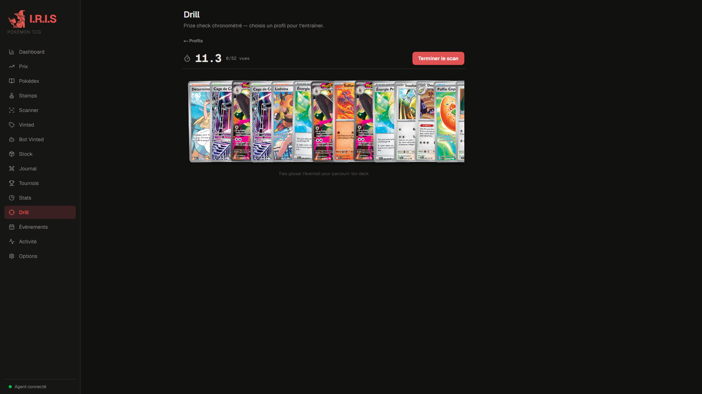<br /><sub><em>Drill: the prize-check trainer, standard or with a real opening hand</em></sub></td>
    <td width="50%">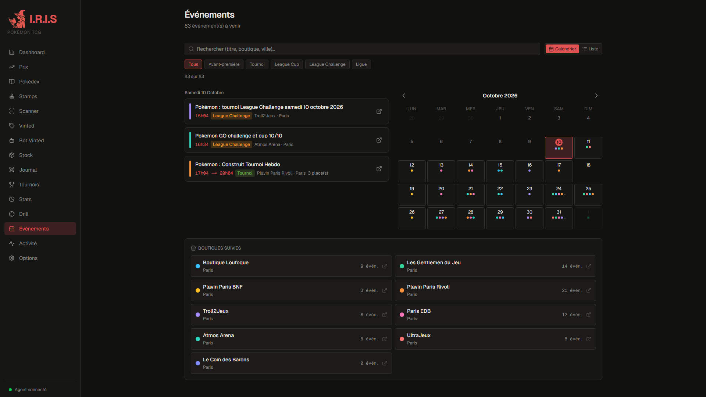<br /><sub><em>Events: nine Paris game shops scraped every 30 minutes into one calendar</em></sub></td>
  </tr>
</table>

The events come from [`scripts/store-events/`](scripts/store-events/), with one extractor per shop: a Shopify JSON feed, PrestaShop HTML, Playwright for calendars drawn in JavaScript, a pretix page, and one shop typed in by hand from its monthly Instagram poster. A shop that fails keeps its previous events instead of disappearing.

---

## 🛠 Under the hood

Here's what's holding it all together.

| Layer | Choice | Why |
|---|---|---|
| **Framework** | Next.js 16 (App Router) + React 19 | Server components load each page's data in parallel on the server; route handlers are the API; `proxy.ts` refreshes the session on every request. |
| **Language** | TypeScript (strict), Python for the bot | One language end to end in the app; the bot is a separate service with its own virtualenv and pytest suite, run where its Vinted sessions live. |
| **UI** | Tailwind CSS v4, Recharts, lucide | Theme tokens in CSS (`@theme`), dark first; Recharts is loaded lazily so the first paint on iOS stays light. |
| **Data** | Supabase: Postgres 17, Auth, Storage, Realtime, `pg_cron` | 71 migrations, 33 tables. Row-level security models "shared collection, personal listings", and Realtime doubles as the bot's job queue. |
| **OCR** | Gemini 3.1 Flash Lite, Google Vision as fallback | One call returns typed JSON instead of raw text to parse; every call's cost is logged. |
| **Catalog & prices** | Cardmarket public dumps, a scraped product index, TCGdex, LimitlessTCG | Exact (set, number) matches, never fuzzy name guesses; every priced card links to its Cardmarket page. |
| **Background jobs** | Vercel Cron (4), GitHub Actions (4), `pg_cron` (1) | Prices three times a day, a nightly price snapshot, weekly downsampling, the dumps every night, events every 30 minutes. |
| **i18n** | next-intl, locale from a cookie | Four languages without URL prefixes; `messages/en.json` types every key. |
| **Testing** | Vitest + Testing Library (happy-dom), pytest | Pure helpers and route handlers in Node, components in a DOM, the agent's scheduler and templates in Python. |
| **Hosting** | Vercel + Supabase; the agent at home | Managed hosting for the app and the database; the bot stays behind my home connection with no open port. |

A few architectural choices worth calling out:

- **The database is the message bus.** The web app and the bot share tables, not an API: jobs, listings, cookies, heartbeats and logs are all rows, and the bot's page in the app is a live view of them.
- **Constraints live in Postgres, not just in the UI.** One Pokédex card per species and one copy for sale per card are partial unique indexes; the swap and the daily price snapshot are SQL functions; the queue for Items is kept in sync by a trigger.
- **Shared collection, personal listings.** Cards and lots belong to both of us; listings, sales and bot settings belong to one. RLS enforces it, and a second layer of restrictive policies keeps one account's Items invisible to the other.
- **Logic in pure helpers.** 52 modules in [`lib/utils/`](lib/utils/), plus [`lib/vinted/`](lib/vinted/) and [`lib/ptcg/`](lib/ptcg/), hold the rules (grouping, staleness, trends, templates, price splits, the game parser); components call them, and the tests target them.
- **Derived data is recomputed, not stored.** PTCG stats come from the raw logs on every render, and the trend arrows come from the price history; when a rule changes, the history follows.

Full code map in **[docs/ARCHITECTURE.md](docs/ARCHITECTURE.md)**.

---

## 🧠 What I learned

- **A limit you can't see is a bug you can't find.** Supabase answers at most 1,000 rows per request, even to an explicit `.range()`, and says nothing. 76 filled Pokédex slots rendered empty, dashboard KPIs were skewed, and the prices page drew most sparklines blank (39,000 history rows asked for, 1,000 received). [`fetchAllRows`](lib/api/fetch-all.ts) now pages every unbounded query in a fixed order, and `.in()` lists go in chunks of 100.
- **Don't let a language model translate what a table already knows.** Gemini reads cards well but invents names: it called dex #3 "Abo". The dex number it reads is reliable, so every name now comes from a static PokéAPI table indexed by that number, and the model's own translations are thrown away.
- **Log what each call costs; estimates drift.** An early version of this README promised €0.0004 per scan. Logging every call's tokens, at rates calibrated against the real Google Cloud invoice, tells the truth: about €0.005 a scan, more than ten times the estimate. Still cheap, and now I know by how much.
- **A refreshed token saved in one place is a revoked token everywhere else.** Vinted rotates the refresh token on every refresh. The agent saved the new one locally, then the next job synced cookies down from Supabase and brought back the old, now revoked one: the account was logged out. Rotated tokens are now pushed back to Supabase twice per job, and a test replays the sequence.
- **Failure paths need the same pacing as success paths.** When a session expired, the agent skipped its cooldown and failed the next job immediately: five jobs in five seconds, the last two answered with HTTP 429. One stale cookie was about to get the IP rate-limited. The cooldown now runs on every exit from a job.
- **Check a reconstruction against data you didn't produce.** The battle-log parser rebuilds the whole board from text, and it would be easy to trust. Instead, every game is checked against the damage breakdowns printed in the log itself, and an effect the parser doesn't model is reported as unchecked rather than passed.

---

## 🚀 Try it yourself

```bash
git clone https://github.com/Huang-Frederic/I.R.I.S.git && cd I.R.I.S
nvm use 22 && npm install

# Click around without any account or key (needs Docker): a local Supabase built
# from the migrations, seeded with the showcase fixtures, served on 127.0.0.1:3100
(cd SHOWCASE/capture && npm install && node capture.mjs --serve)
# sign in with one of the two accounts in SHOWCASE/capture/fixtures/users.json

# Or run it for real against your own Supabase project
cp .env.example .env.local                               # keys: see docs/SETUP.md
npx supabase link --project-ref "$PROJECT_REF" && npx supabase db push
npm run restore-catalog && npm run upload-cardmarket-dumps     # the catalog, then Cardmarket's products and prices
npm run restore-cardmarket-expansions && npm run restore-cardmarket-index   # set codes, then the card index (last)
npm run dev                                              # → http://localhost:3000
```

The full walkthrough (Supabase project, `pg_cron`, Gemini and Vision keys, the Vercel crons, the GitHub Actions secrets and the Vinted agent) lives in **[docs/SETUP.md](docs/SETUP.md)**.

---

## 📚 Going deeper

| Doc | What you'll find |
|---|---|
| **[docs/ARCHITECTURE.md](docs/ARCHITECTURE.md)** | The code map: what runs where, the request lifecycle, every data flow step by step. |
| **[docs/FEATURES.md](docs/FEATURES.md)** | Every page and feature, with its rules and edge cases. |
| **[docs/SETUP.md](docs/SETUP.md)** | Every key, every service, every scheduled job, from an empty Supabase project to a deployed app. |
| **[docs/SUPABASE.md](docs/SUPABASE.md)** | The 33 tables, the RLS model, the SQL functions, storage buckets, and the migration index. |
| **[docs/COMMANDS.md](docs/COMMANDS.md)** | Every npm script and every script in `scripts/`, with what it reads and writes. |
| **[docs/CARDMARKET_MAPPING.md](docs/CARDMARKET_MAPPING.md)** | How the (set, number) → Cardmarket product index was built and is kept up to date. |
| **[vinted-agent/README.md](vinted-agent/README.md)** | Running the posting agent, its sessions and its deployment. |
| **[docs/CONTRIBUTING.md](docs/CONTRIBUTING.md)** | The conventions of the repo: branches, commits, translations, migrations, tests. |
| **[docs/TECH_DEBT.md](docs/TECH_DEBT.md)** | What's not right yet, why, and what fixing it would take. |
| **[docs/CHANGELOG.md](docs/CHANGELOG.md)** | The build history, release by release. |

---

## 🧪 Testing

```bash
npm test                 # Vitest, run once (npm run test:watch to watch)
npm run typecheck        # tsc --noEmit
npm run lint             # ESLint
cd vinted-agent && .venv/Scripts/python -m pytest      # the agent (.venv/bin/python on macOS/Linux)
```

The app's tests sit next to the code they cover. In `lib/` they test the pure helpers, the pricing and enrichment logic, and the game parser, run against six real battle logs. In `components/` they render components with Testing Library on happy-dom, and in `app/api/` they call route handlers against a mocked Supabase. The agent's pytest suite covers the scheduler, the cookie sync, the listing templates and Vinted's per-category attributes. **1,401 Vitest tests in 156 files and 153 pytest tests, all passing; zero type errors, zero lint warnings.**

---

## 🗺 What's next

- Bring the coach's analyses back into the app: the API still accepts them, but no page shows them since the replay page went away in September.
- A CI workflow that runs the 1,554 tests and the type check on every push to `prod`.
- Renew the BrightData token, then import the sets released since May (44 expansions, including the 30th Celebration) so the nightly price import stops dropping them.
- Fix the scheduled database backup and move it off the public repository's releases.
- Give Items the same sold flow and bulk actions as cards and lots.

---

## 🧾 Honest tech debt

Every feature here shipped with trade-offs, and the biggest ones are deliberate. `CardScanForm` is 1,460 lines with 25 `useState` calls, and `VintedList` is close to 1,100: both still earn their size, and splitting them is planned, not urgent. About twenty modals bypass the shared `Modal` component. The two accounts are hard-coded by user id in 17 files, which is fine for a two-person app and wrong for anything bigger. There is no end-to-end test and no CI yet, so the suites run before each push, by hand. One find from the latest audit is worse than a trade-off: the scheduled database backup has been reporting success while uploading empty files.

The full list, with why each item was deferred and what fixing it would take, is in **[docs/TECH_DEBT.md](docs/TECH_DEBT.md)**.

---

## 📄 License

This is a personal project. Source code is provided as-is for portfolio and learning purposes. No license is granted for commercial use or redistribution.

Pokémon and all related names and images are trademarks of Nintendo, The Pokémon Company, Creatures and GAME FREAK; this project is not affiliated with them. Card images come from Cardmarket and TCGdex, sprites from [PokeAPI](https://pokeapi.co), and catalog data from Cardmarket's public dumps, [TCGdex](https://tcgdex.dev) and [LimitlessTCG](https://limitlesstcg.com).

---

<div align="center">

Built with curiosity, far too much coffee, and a lot of Pokémon cards.

</div>
