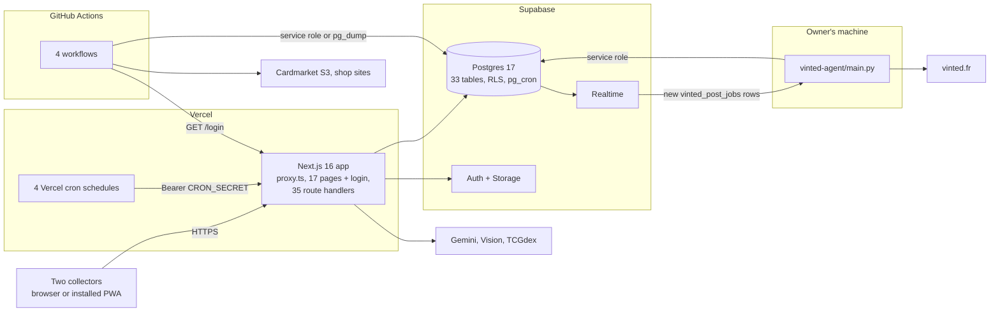
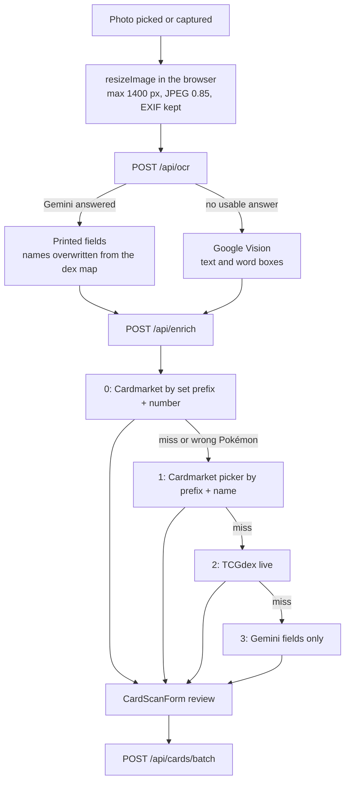
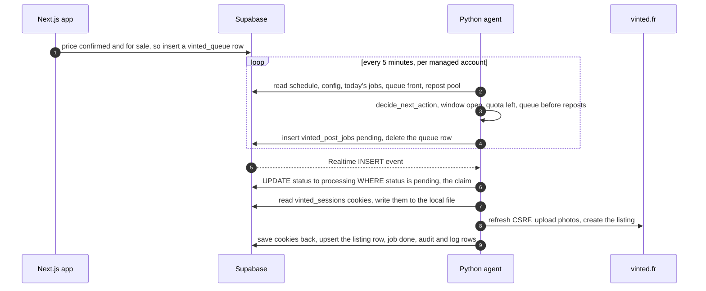
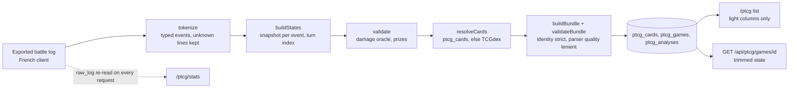

# Architecture

A code map of I.R.I.S (Intelligent Recognition Inventory System): what runs where, where each piece of code lives, and how data moves between the pieces. It was checked against the code on 2026-10-10 (864 commits, 2026-04-26 to 2026-10-07).

I.R.I.S is a Next.js 16 PWA on top of Supabase. Two collectors share one Pokémon TCG collection through it. They scan cards (Gemini OCR plus a Cardmarket-first enrichment pipeline), price them from Cardmarket data, sell them on Vinted from separate accounts (a Python bot does the posting), track prices over time, and import Pokémon TCG Live games for analysis.

Companion documents: [FEATURES.md](FEATURES.md) (what the app does), [SUPABASE.md](SUPABASE.md) (database reference), [SETUP.md](SETUP.md) (installation), [COMMANDS.md](COMMANDS.md) (scripts and endpoints), [CARDMARKET_MAPPING.md](CARDMARKET_MAPPING.md) (how the card index is built), [TECH_DEBT.md](TECH_DEBT.md) and [CHANGELOG.md](CHANGELOG.md). The bot has its own [README](../vinted-agent/README.md) and [deployment guide](../vinted-agent/DEPLOY.md), and the Cardmarket scraper has [one too](../scrapers/cardmarket/README.md).

## Contents

- [Overview](#overview)
  - [What runs where](#what-runs-where)
  - [Schedules](#schedules)
  - [External services](#external-services)
  - [Stack and size](#stack-and-size)
- [Repository layout](#repository-layout)
  - [Top level](#top-level)
  - [app](#app)
  - [components](#components)
  - [lib](#lib)
  - [messages and public](#messages-and-public)
  - [scripts and scrapers](#scripts-and-scrapers)
  - [vinted-agent](#vinted-agent)
  - [supabase and backups](#supabase-and-backups)
  - [Automation and tooling](#automation-and-tooling)
  - [Tests](#tests)
  - [Where to change things](#where-to-change-things)
- [Request lifecycle](#request-lifecycle)
  - [The proxy](#the-proxy)
  - [The app layout](#the-app-layout)
  - [Server components](#server-components)
  - [Route handlers](#route-handlers)
  - [Supabase clients](#supabase-clients)
  - [Caching and navigation](#caching-and-navigation)
- [Data flows](#data-flows)
  - [Data flow: scan pipeline](#data-flow-scan-pipeline)
  - [Data flow: pricing pipeline](#data-flow-pricing-pipeline)
  - [Data flow: Vinted listings and the bot](#data-flow-vinted-listings-and-the-bot)
  - [Data flow: PTCG games](#data-flow-ptcg-games)
  - [Data flow: store events](#data-flow-store-events)
  - [Data flow: backups](#data-flow-backups)
- [Cross-cutting concerns](#cross-cutting-concerns)
  - [Auth and the RLS model](#auth-and-the-rls-model)
  - [i18n](#i18n)
  - [PWA and service worker](#pwa-and-service-worker)
  - [Audit logging](#audit-logging)
  - [Realtime and polling](#realtime-and-polling)
  - [Configuration](#configuration)
- [Design decisions](#design-decisions)

---

## Overview

### What runs where



| Where | What runs there | Code |
|---|---|---|
| Vercel | The Next.js app: [`proxy.ts`](../proxy.ts), 17 pages under `app/(app)` plus `/login`, and 35 route handlers. Vercel Cron calls two of those handlers on four schedules. | [`app/`](../app/), [`vercel.json`](../vercel.json) |
| Supabase | Postgres 17 (33 public tables, row-level security enabled on all of them, 71 migrations), Auth (email and password), Storage (three public-read photo buckets and one private backup bucket), Realtime, and `pg_cron` (one weekly job). | [`supabase/`](../supabase/) |
| The owner's machine | The Python Vinted agent, [`vinted-agent/main.py`](../vinted-agent/main.py). It only opens outbound connections: Supabase (service role key; queries plus a Realtime channel) and vinted.fr. Launchers exist for WSL, macOS and Windows, and a systemd unit for a VPS. | [`vinted-agent/`](../vinted-agent/) |
| GitHub Actions | Four workflows: nightly Cardmarket dump upload, nightly database backup, event scraping every 30 minutes, and a keep-warm ping. None of them runs tests. | [`.github/workflows/`](../.github/workflows/) |

The app and the agent never call each other. The database is the integration point: the app writes jobs, queue rows, settings and cookies; the agent reads them, does the work on Vinted, and writes the results back. See [Design decisions](#design-decisions) for why.

### Schedules

All times are UTC.

| When | Runner | What happens |
|---|---|---|
| 01:07 daily | GitHub Actions, [`cardmarket-prices.yml`](../.github/workflows/cardmarket-prices.yml) | `npm run upload-cardmarket-dumps` refreshes `cardmarket_expansions`, `cardmarket_products` and `cardmarket_pricing` from Cardmarket's public S3 dumps |
| 03:00 daily | [`backup.yml`](../.github/workflows/backup.yml) | `pg_dump` of eight user-data tables, published as a GitHub Release |
| 08:00, 14:00, 20:00 daily | Vercel cron | `GET /api/prices/update?limit=700` refreshes the 700 stalest card prices |
| 23:55 daily | Vercel cron | `/api/prices/snapshot` writes one `price_history` row per priced card |
| Sundays 04:00 | `pg_cron` job `downsample-price-history` | `downsample_price_history()` thins old history rows |
| Every 10 minutes, 06:00 to 23:59 | [`keep-warm.yml`](../.github/workflows/keep-warm.yml) | `GET <APP_URL>/login` so the serverless function stays warm |
| Every 30 minutes | [`store-events.yml`](../.github/workflows/store-events.yml) | `npm run scrape-events` refreshes `store_events` |
| Every 5 minutes | Python agent | scheduling loop, once per managed account |
| Every 30 seconds | Python agent | heartbeat upsert, once per managed account |

All four workflows can also be started by hand (`workflow_dispatch`).

### External services

| Service | Used for | Where |
|---|---|---|
| Google Gemini (`gemini-3.1-flash-lite-preview`) | Primary card OCR | [`lib/api/gemini-vision.ts`](../lib/api/gemini-vision.ts) |
| Google Cloud Vision | OCR fallback | [`lib/api/vision.ts`](../lib/api/vision.ts) |
| TCGdex (`api.tcgdex.net/v2`) | Enrichment strategy 2, pricing fallback, Pokémon TCG Live card data | [`lib/api/tcgdex.ts`](../lib/api/tcgdex.ts), [`lib/ptcg/cards.ts`](../lib/ptcg/cards.ts) |
| Cardmarket | Public S3 dumps (products and price guide), product images (through a proxy), scraped gallery pages for the card index | [`scripts/upload-cardmarket-dumps.ts`](../scripts/upload-cardmarket-dumps.ts), [`app/api/cm-img/[id]/route.ts`](../app/api/cm-img/[id]/route.ts), [`scrapers/cardmarket/`](../scrapers/cardmarket/) |
| BrightData Web Unlocker | Fetching Cardmarket pages behind bot protection (scripts only) | [`scrapers/cardmarket/`](../scrapers/cardmarket/), [`scripts/update-cardmarket-expansions.ts`](../scripts/update-cardmarket-expansions.ts) |
| LimitlessTCG | One-time bootstrap of `tcg_catalog` | [`scripts/scrape-limitlesstcg.ts`](../scripts/scrape-limitlesstcg.ts) |
| PokéAPI | Species names (generated once into a JSON file) and sprites (images) | [`scripts/generate-pokemon-names.ts`](../scripts/generate-pokemon-names.ts), [`next.config.ts`](../next.config.ts) |
| Vinted (vinted.fr) | Posting, deleting, category attributes. Only the agent talks to it. | [`vinted-agent/vinted_api.py`](../vinted-agent/vinted_api.py) |
| CapSolver | Optional CAPTCHA solving when Vinted serves a challenge | [`vinted-agent/vinted_api.py`](../vinted-agent/vinted_api.py) |

### Stack and size

| Area | Choice |
|---|---|
| Web | Next.js 16.2 (App Router, `proxy.ts`), React 19.2, TypeScript in strict mode, Tailwind CSS v4 (design tokens in [`app/globals.css`](../app/globals.css)) |
| Backend | Supabase (`@supabase/ssr`, `@supabase/supabase-js`), `next-intl` 4 |
| UI libraries | Recharts, `@dnd-kit` (drag to reorder the bot queue), `react-window` (virtual list on `/prices`), `lucide-react`, `piexifjs` (EXIF-preserving resize) |
| Tests | Vitest 4, Testing Library, happy-dom; pytest for the agent |
| Scripts | `tsx` on Node 22 or later; the agent runs on Python with `supabase-py`, `curl_cffi`, Pillow, `requests` |

| Measure | Value (2026-10-10) |
|---|---|
| Commits | 864 |
| SQL migrations | 71 |
| Public tables | 33 |
| Route handler files | 35 |
| Pages | 17 under `app/(app)`, plus `/login` |
| Vitest | 156 files, 1,401 tests |
| pytest | 153 tests in 5 files (`vinted-agent/`) |
| Locales | 4 (en, fr, ja, zh) |

---

## Repository layout

### Top level

```
.
├── app/                    Next.js App Router: pages, layouts, route handlers
├── components/             React components, grouped by feature area
├── lib/                    Everything that is not UI: helpers, API clients, Vinted and PTCG logic
├── messages/               next-intl dictionaries (en is the typed source; fr, ja, zh)
├── public/                 sw.js, PWA icons, logos
├── scripts/                One-off and scheduled Node scripts, run with tsx
├── scrapers/cardmarket/    Standalone scraper that fills the Cardmarket card index
├── supabase/               config.toml and 71 SQL migrations
├── vinted-agent/           Python posting bot (own runtime, own tests)
├── backups/                Versioned snapshots of the catalog tables
├── docs/                   Reference documents
├── SHOWCASE/               README media and the tooling that re-records it
├── .github/workflows/      Four scheduled workflows
├── .claude/                Dev-server launch config and the ptcg-coach skill
├── proxy.ts                Next.js 16 middleware (session, redirects, locale cookie)
├── i18n.ts, global.d.ts    next-intl request config and typed message keys
├── cardmarket_expansions.json   Committed map of Cardmarket expansion ids to names
└── next.config.ts, vercel.json, vitest.config.ts, tsconfig.json, eslint.config.mjs, package.json
```

Imports use the `@/` alias, which maps to the repository root ([`tsconfig.json`](../tsconfig.json)). `scrapers/**` is excluded from the root TypeScript project.

### app

| Path | Role |
|---|---|
| [`app/layout.tsx`](../app/layout.tsx) | Root layout: fonts, `data-theme` from the `theme` cookie, next-intl provider, service worker registration, status-bar color |
| [`app/manifest.ts`](../app/manifest.ts) | PWA manifest (`start_url` is `/dashboard`) |
| [`app/globals.css`](../app/globals.css) | Tailwind v4 `@theme` tokens. Dark is the default; light is `data-theme="light"` |
| [`app/(auth)/login/`](../app/(auth)/login/) | Public login page and the `signIn` / `signOut` server actions ([`actions.ts`](../app/(auth)/login/actions.ts)) |
| [`app/(app)/layout.tsx`](../app/(app)/layout.tsx) | Shell for every signed-in page (see [The app layout](#the-app-layout)) |
| [`app/(app)/loading.tsx`](../app/(app)/loading.tsx) | Skeleton shown while any signed-in page fetches |
| [`app/api/`](../app/api/) | The 35 route handlers |

The 17 pages under `app/(app)`:

| Route | File | Purpose |
|---|---|---|
| `/` | [`page.tsx`](../app/(app)/page.tsx) | Redirects to `/dashboard` |
| `/dashboard` | [`dashboard/page.tsx`](../app/(app)/dashboard/page.tsx) | KPIs, sales per account, OCR cost, rarity mix, scan heatmap (11 parallel queries) |
| `/prices` | [`prices/page.tsx`](../app/(app)/prices/page.tsx) | Price history: portfolio chart, top movers, per-card sparklines. The only page that is a client component |
| `/pokedex` | [`pokedex/page.tsx`](../app/(app)/pokedex/page.tsx) | The 1,025-slot Pokédex grid and its drawer |
| `/stamps` | [`stamps/page.tsx`](../app/(app)/stamps/page.tsx) | Gallery of every card whose `variant` is `stamp` |
| `/submit` | [`submit/page.tsx`](../app/(app)/submit/page.tsx) | Scanner, "other and lot" form, Items form |
| `/vinted` | [`vinted/page.tsx`](../app/(app)/vinted/page.tsx) | Listings workspace for cards, lots and Items (12 parallel queries) |
| `/vinted/bot` | [`vinted/bot/page.tsx`](../app/(app)/vinted/bot/page.tsx) | Monitoring and control of the posting bot |
| `/stock` | [`stock/page.tsx`](../app/(app)/stock/page.tsx) | Cards and lots parked in stock (`collection`) |
| `/ptcg` | [`ptcg/page.tsx`](../app/(app)/ptcg/page.tsx) | Battle logs: import and history |
| `/ptcg/stats` | [`ptcg/stats/page.tsx`](../app/(app)/ptcg/stats/page.tsx) | Statistics recomputed from raw logs and tournaments |
| `/ptcg/tournaments`, `/ptcg/tournaments/[id]` | [`list`](../app/(app)/ptcg/tournaments/page.tsx), [`detail`](../app/(app)/ptcg/tournaments/[id]/page.tsx) | Tournament results and rounds |
| `/drill` | [`drill/page.tsx`](../app/(app)/drill/page.tsx) | Timed prize-check trainer over saved decklists |
| `/events` | [`events/page.tsx`](../app/(app)/events/page.tsx) | Calendar of local shop events |
| `/logs` | [`logs/page.tsx`](../app/(app)/logs/page.tsx) | Activity log (the last 100 `audit_logs` rows) |
| `/options` | [`options/page.tsx`](../app/(app)/options/page.tsx) | Theme, language, account, PWA install, refresh-all-prices, manual backups |

The 35 route handlers, by resource. Reads are mostly done by server components or by the browser client under RLS, so the handlers carry mutations and everything that needs a server secret.

| Path | Methods | Role |
|---|---|---|
| `/api/ocr` | POST | Gemini, with Vision as fallback; logs usage |
| `/api/enrich` | POST | Cardmarket-first enrichment, strategies 0 to 3 |
| `/api/cards` | POST | Insert one card |
| `/api/cards/batch` | POST | Insert up to 50 copies in one call |
| `/api/cards/[id]` | PATCH, DELETE | Status, prices, notes; sold and traded side effects |
| `/api/cards/[id]/clone` | POST | Duplicate a stock card |
| `/api/cards/[id]/photo` | POST | Replace a photo and propagate it to sibling rows |
| `/api/pokedex/suggest`, `/api/pokedex/replace` | POST | Destination suggestion; atomic Pokédex swap through an RPC |
| `/api/lots`, `/api/lots/[id]` | POST; PATCH, DELETE | Lots (bundles), including quantity splits on sale |
| `/api/other-items`, `/api/other-items/[id]` | POST; PATCH, DELETE | Items (non-card products), one account only |
| `/api/listings`, `/api/listings/[kind]/[id]` | POST; DELETE | Per-account listing stamp for a card or lot |
| `/api/trades/photo` | POST | Photo of a trade batch |
| `/api/vinted/post-job`, `/api/vinted/bump-job`, `/api/vinted/sessions` | POST | Manual post or repost job; bump job; paste Vinted cookies |
| `/api/prices/update` | GET, POST | Bulk (cron or "refresh all") and single-card price refresh |
| `/api/prices/snapshot` | GET, POST | Daily price history snapshot (cron) |
| `/api/cm-img/[id]` | GET | Cardmarket image proxy |
| `/api/backup/manual`, `/api/backup/manual/[filename]` | POST, GET; GET, DELETE | Create and list manual backups; signed download; delete |
| `/api/logs` | GET | Paged, filterable activity log |
| `/api/ptcg/games`, `/games/resolve`, `/games/[id]` | POST; POST; GET, PATCH | Import a battle log; preview its decks; read and correct a game |
| `/api/ptcg/drill-profiles`, `/resolve`, `/[id]` | GET, POST; POST; GET, PATCH, DELETE | Drill profiles |
| `/api/ptcg/tournaments` and nested | POST; PATCH; POST; PATCH, DELETE | Tournaments and their rounds |

### components

| Folder | What it holds |
|---|---|
| [`layout/`](../components/layout/) | Shell: `Sidebar` (desktop, with the agent online dot), `BottomNav` and [`nav-items.ts`](../components/layout/nav-items.ts) (mobile bar with a Pokéball bubble), `InstallPrompt`, `LanguageToggle`, `ThemeToggle`, `SignOutButton`, `PageTitle`, `PageWidthContainer`, `ServiceWorkerRegister` |
| [`ui/`](../components/ui/) | Shared widgets: `Modal`, `RowActionsMenu`, `CardmarketLink`, `PriceFreshnessBadge`, `PriceWithTrend` with `PriceTrendsProvider`, `RefreshPriceButton`, `PokemonSpriteBadge`, `MagnifierLoupe`, `Pokeball`, `VintedLogo` |
| [`submit/`](../components/submit/) | The `/submit` page: `SubmitTabs`, `BatchForm` (multi-photo scanner), `CardScanForm` (the review form, with `.helpers`, `.constants` and `UI` files), `OtherForm`, `PhotoDropzone`, `CameraCaptureOverlay`, `SaveSuccessModal`, `StickyCardPreview` |
| [`cards/`](../components/cards/) | Modals shared by the scan flow and the Pokédex: `MoveToPokedexModal`, `PokedexReplaceModal`, `PokedexCompareModal`, `DuplicateForSaleModal`, `DuplicatePhotoModal`, `ScanSuggestion` |
| [`scanner/`](../components/scanner/) | `CardMatchPreview` |
| [`pokedex/`](../components/pokedex/) | `PokedexGrid` with memoised `PokedexCell`s, `PokedexDrawer` (parts in `drawer/`), `PokedexFilters`, `PokedexListItem`, `PokedexScanModal`, `PokedexCardActionsModal` |
| [`stock/`](../components/stock/) and [`lots/`](../components/lots/) | `StockList`, `StockRow`, `StockFilters`; `LotRow`, `LotSoldRow`, `LotQuantityChip`, `LotAnnonceModal`, `StockLotSection` |
| [`other-items/`](../components/other-items/) | `OtherItemForm`, `CategoryPicker` (over Vinted's category tree), `OtherItemVintedFields`, `hooks/useCatalogAttributes` |
| [`vinted/`](../components/vinted/) | The listings workspace: `VintedList`, `VintedRow`, `VintedFilters`, `AnnonceModal`, `SoldModal`, the bulk and trade modals, `ListingBadges`, `EditablePriceCell`, `OtherItemRow` and more; `hooks/` (5); `monitoring/` for `/vinted/bot` (queue and repost grids, settings, logs, status bar, `hooks/`) |
| [`price/`](../components/price/) and [`prices/`](../components/prices/) | Price detail modal pieces (`PriceDetailModal`, `Sparkline`, `DeltaMatrix`, `PriceHistoryChart`); the `/prices` page (`StatsHeader`, `PortfolioValueChart`, `TopMoversPanel`, `AllCardsList`) |
| [`dashboard/`](../components/dashboard/) | KPI strip, charts (Recharts, loaded lazily), heatmap, sales and rare-card lists |
| [`ptcg/`](../components/ptcg/) | Battle logs (`BattleLogsPage`, `CreateLogModal`, `GameLogViewer`), `StatsPage`, tournaments, `DrillHome`, `PtcgDrill`, `DrillProfileForm`, sprite pickers |
| [`events/`](../components/events/), [`logs/`](../components/logs/), [`options/`](../components/options/), [`stamps/`](../components/stamps/) | One feature each: calendar, activity log, settings sections, stamp gallery |

Shared component patterns: `EditablePriceCell` takes an `endpoint` and a `priceField` so it serves cards and lots; `SoldModal` takes a discriminated union (`kind: 'card'` or `'lot'`); `RefreshPriceButton` is used wherever a single card needs a price refresh.

### lib

| Folder | Role |
|---|---|
| [`lib/utils/`](../lib/utils/) | Pure, typed helpers, most with a co-located test. Grouped by theme below |
| [`lib/api/`](../lib/api/) | Clients and lookups: `gemini-vision.ts`, `vision.ts`, `tcgdex.ts`, `tcgdex-set-mapping.ts`, `cardmarket-enrich.ts`, `cardmarket-pricing.ts`, `tcg-catalog.ts`, `price-history.ts`, and `fetch-all.ts` |
| [`lib/vinted/`](../lib/vinted/) | Vinted domain logic shared by routes and the monitoring UI: queue sync for cards, lots and Items, eligibility, cross-account delete jobs, group key and sort, snake ordering, next-window estimate, monitoring access check, Items attribute parsing |
| [`lib/ptcg/`](../lib/ptcg/) | The Pokémon TCG Live pipeline: `tokenize.ts`, `state.ts`, `validate.ts`, `index.ts` (`parseGame`), `cards.ts`, `bundle.ts`, `digest.ts`, `game-stats.ts`, `score.ts`, `protagonists.ts`, `archetype-dex.ts`, `tournaments.ts`, `decklist.ts`, `drill-resolve.ts`, and real battle logs in `fixtures/` |
| [`lib/supabase/`](../lib/supabase/) | `client.ts`, `server.ts`, `proxy.ts`, `service.ts` (see [Supabase clients](#supabase-clients)) |
| [`lib/hooks/`](../lib/hooks/) | `useUserContext` (the two accounts) and `useAgentStatus` (bot online or offline) |
| [`lib/data/`](../lib/data/) | Static data: `pokemon-names.json` (fr, en, ja by national dex number) with `pokemon-names.ts`, `vinted-categories.json`, `vinted-colors.json`, `event-sources.ts` |
| [`lib/constants/`](../lib/constants/) | [`pricing.ts`](../lib/constants/pricing.ts): `PRICE_COEFFICIENT = 0.85` |
| [`lib/types/`](../lib/types/) | [`index.ts`](../lib/types/index.ts) (cards, lots, Items, listings, PTCG, bot rows) and `price-history.ts` |

`lib/utils/` by theme:

| Theme | Files |
|---|---|
| API plumbing | `api-response.ts` (error shape), `audit-log.ts`, `translate-error.ts` |
| Cards and inventory | `group-cards.ts`, `labels.ts`, `validate-card-form.ts`, `build-batch-rows.ts`, `sibling-photos.ts`, `pokedex-suggestion.ts`, `pokedex-mismatch.ts`, `pokedex-swap.ts`, `restock-detection.ts`, `promote-detection.ts`, `split-bulk-price.ts`, `listings.ts`, `user-colors.ts` |
| Scan and images | `resize-image.ts`, `image-postprocess.ts`, `parse-set-number.ts`, `extract-from-words.ts`, `ocr-cost.ts`, `json-from-text.ts`, `text-normalize.ts` |
| Pricing | `categorize-pricing-card.ts`, `format-staleness.ts`, `price-trend.ts`, `stock-value.ts`, `cardmarket-url.ts`, `format-currency.ts` |
| Vinted text and lists | `vinted-template.ts`, `lot-template.ts`, `other-item-template.ts`, `vinted-title.ts`, `vinted-filter.ts`, `vinted-list-filters.ts`, `vinted-interleave.ts`, `listing-stale.ts` |
| Dashboard and events | `dashboard-queries.ts`, `event-calendar.ts`, `filter-events.ts`, `format-event.ts`, `group-by-day.ts` |
| Pokémon data and PTCG UI | `pokemon-generations.ts`, `pokemon-search.ts`, `pokemon-sprite.ts`, `format-name.ts`, `ptcg-event-label.ts`, `ptcg-preview-position.ts`, `inline-markup.ts` |
| Other | `manual-dump.ts` (backup payload), `pwa-install.ts`, `trade-photo.ts`, `test-fixtures.ts` |

Three modules are not wired into anything today: `components/submit/LotForm.tsx` (the "other and lot" tab uses `OtherForm`), `lib/vinted/pipeline-split.ts` and `lib/ptcg/parse-quality.ts`. They only appear in their own tests or nowhere.

### messages and public

- [`messages/`](../messages/) holds `en.json`, `fr.json`, `ja.json` and `zh.json` (about 1,240 keys each). `en.json` is the typed source (see [i18n](#i18n)).
- [`public/`](../public/) holds [`sw.js`](../public/sw.js), `icons/` (192, 512 and 512 maskable PNGs, generated by [`scripts/generate-icons.ts`](../scripts/generate-icons.ts) from `logo.png`), `logo.png` and `vinted-logo.jpeg`.

### scripts and scrapers

Scripts run with `tsx` and the service role key from `.env.local`; each npm alias is in [`package.json`](../package.json) and documented in [COMMANDS.md](COMMANDS.md).

| Purpose | Files in [`scripts/`](../scripts/) |
|---|---|
| Catalog bootstrap | `scrape-limitlesstcg.ts`, `generate-pokemon-names.ts` |
| Cardmarket data | `upload-cardmarket-dumps.ts` (the nightly one), `update-cardmarket-expansions.ts` (teach the app a new set), `scrape-cardmarket-expansion-names.ts`, `parse-cardmarket-expansions.ts`, `build-cardmarket-input.ts`, `generate-rescrape-input.ts`, `recommend-scrape-targets.ts`, `fix-cardmarket-set-prefix.ts`, `scrape-cardmarket-cards.ts` (Playwright fallback for wheel-type promo sets), `probe-cardmarket-expansion.ts`, `debug-scraper-fetch.ts`, `reenrich-existing-cards.ts` |
| Snapshots and restore | `snapshot-catalog.ts`, `restore-catalog.ts`, `snapshot-cardmarket-index.ts`, `restore-cardmarket-index.ts`, `restore-cardmarket-expansions.ts` |
| Store events | [`store-events/`](../scripts/store-events/): `core.ts` (engine), `sources.ts` (the list), `types.ts`, `extractors/` (one file per shop), `lib/` (HTTP, browser, date parsing, classification) |
| PTCG tooling | `ptcg-digest.ts`, `ptcg-bundle.ts`, `skill-zip.ts` |
| OCR benchmarks | `bench-multi-model.ts`, `bench-multilang.ts`, `measure-gemini-prompt-tokens.ts`, `inspect-ocr.ts`, `probe-tcgdex-fails.ts` |
| Operations | `check-supabase-state.ts`, `generate-icons.ts`, `wipe-user-data.sql`, [`backup/rotate.sh`](../scripts/backup/rotate.sh) |
| Data | `data/` (`cardmarket-modern-expansions.json`; the PTCG card cache is git-ignored) |

[`scrapers/cardmarket/`](../scrapers/cardmarket/) is a standalone package with its own `package.json` and Vitest config. It fetches each expansion's Cardmarket gallery through BrightData, parses it with jsdom ([`src/scrape.ts`](../scrapers/cardmarket/src/scrape.ts)) and upserts `cardmarket_card_index` and the expansion's `set_prefix` ([`src/supabase.ts`](../scrapers/cardmarket/src/supabase.ts)). [CARDMARKET_MAPPING.md](CARDMARKET_MAPPING.md) explains why the index exists.

### vinted-agent

Its own runtime and tests; see its [README](../vinted-agent/README.md) and [DEPLOY.md](../vinted-agent/DEPLOY.md).

| File | Role |
|---|---|
| [`main.py`](../vinted-agent/main.py) | Entry point, the loops, the three job processors (cards, lots, Items), failure handling, cookie sync, and the Python builders for titles and descriptions |
| [`scheduler.py`](../vinted-agent/scheduler.py) | Pure decision functions: `decide_next_action`, `pick_queue_front`, `sort_repost_candidates`, `should_requeue` |
| [`vinted_api.py`](../vinted-agent/vinted_api.py) | `VintedClient`: `curl_cffi` with Chrome impersonation, CSRF and token refresh, photo upload, create and delete listing, category attributes, optional CapSolver |
| [`catalog_attributes.py`](../vinted-agent/catalog_attributes.py) | Pure parsing of a category's attributes, parcel-size choice, pre-post validation of Items |
| [`titles.py`](../vinted-agent/titles.py) | Title clean-up that avoids Vinted's "too many capitals" rejection |
| [`audit_log.py`](../vinted-agent/audit_log.py) | Writes `audit_logs` rows with `actor_type = 'agent'` |
| `import_cookies.py` | Converts a browser cookie export into the `cookies_*.json` shape |
| One-off tools | `export_my_listings.py`, `fetch_categories.py` (regenerates `lib/data/vinted-categories.json`), `import_scraped_other_items.py`, `activate_scraped_other_items.py`, `clear_jobs.py` |
| Launchers | `start.sh` (WSL), `start-mac.sh` and `setup-mac.sh`, `start-windows.ps1` and `setup-windows.ps1`, [`deploy/vinted-agent.service`](../vinted-agent/deploy/vinted-agent.service) (systemd) |
| Tests | Five `*_test.py` files next to the modules they test |

Untracked and secret: `.env`, `cookies_*.json` and `vinted_users.json` are git-ignored. The cookies' source of truth is the `vinted_sessions` table; `vinted_users.json` lists which Supabase users the agent manages.

### supabase and backups

- [`supabase/migrations/`](../supabase/migrations/): 71 timestamp-prefixed SQL files, applied in order. [`config.toml`](../supabase/config.toml) pins Postgres 17 and the API row cap of 1,000.
- [`backups/`](../backups/): committed snapshots of the data that is expensive to rebuild: `tcg_catalog.jsonl.gz`, `cardmarket_card_index.jsonl.gz`, `cardmarket_expansions.jsonl.gz` and `rarity_ranks.json`. See [backups/README.md](../backups/README.md) and [Data flow: backups](#data-flow-backups).

### Automation and tooling

| Path | Role |
|---|---|
| [`.github/workflows/`](../.github/workflows/) | `backup.yml`, `cardmarket-prices.yml`, `keep-warm.yml`, `store-events.yml` (see [Schedules](#schedules)) |
| [`.claude/skills/ptcg-coach/`](../.claude/skills/ptcg-coach/) | A Claude skill that debriefs a Pokémon TCG Live game and produces the JSON the app imports ([`SKILL.md`](../.claude/skills/ptcg-coach/SKILL.md) plus `references/`). [`ptcg-coach.zip`](../.claude/skills/ptcg-coach.zip) is built by `npm run skill-zip`, and a test rebuilds it and compares |
| [`.claude/launch.json`](../.claude/launch.json) | Dev-server launch configuration |
| [`SHOWCASE/`](../SHOWCASE/) | `media/` (the images and GIFs the README embeds), `archive/` (previous README images), and `capture/`, the tooling that re-records them |

`SHOWCASE/capture/` never touches the production project. [`stack.mjs`](../SHOWCASE/capture/stack.mjs) starts a throwaway local Supabase in Docker from this repository's migrations; [`seed.mjs`](../SHOWCASE/capture/seed.mjs) loads sanitized fixtures (a snapshot of production data from 2026-10-10 with test accounts and fake Vinted ids) plus the catalog snapshots from `backups/`; [`app.mjs`](../SHOWCASE/capture/app.mjs) serves `next dev` on port 3100 against that stack with every external API key blanked; [`capture.mjs`](../SHOWCASE/capture/capture.mjs) drives Playwright and records each shot, answering the OCR call from a fixture; [`make_gif.py`](../SHOWCASE/capture/make_gif.py) turns recordings into GIFs with ffmpeg.

### Tests

- Vitest runs through [`vitest.config.ts`](../vitest.config.ts): happy-dom, globals on, `@` aliased to the repository root, and `server-only` aliased to an empty shim ([`vitest.shim-server-only.ts`](../vitest.shim-server-only.ts)) so server-flagged modules can be tested.
- Tests sit beside the code (`foo.ts`, `foo.test.ts`). Route handlers are tested directly (`route.test.ts` next to `route.ts`), the PTCG parser runs against the real logs in `lib/ptcg/fixtures/`, and most test files cover `lib/`. Component tests exist for the stateful screens (PTCG, Vinted, Items).
- The agent is tested with pytest. `scrapers/cardmarket/` has its own Vitest config.
- There are no end-to-end tests and no CI that runs tests: the four workflows are operational jobs. Run `npm test`, `npm run typecheck` and `npm run lint` by hand, and `pytest` inside `vinted-agent/`.
- The codebase is not Prettier-clean, so `npm run format:check` reports most files. Do not run `npm run format` over whole files; it would rewrite them.

### Where to change things

| To change | Go to |
|---|---|
| The OCR prompt or model | [`lib/api/gemini-vision.ts`](../lib/api/gemini-vision.ts) (`BASE_PROMPT`, `GEMINI_MODEL`); recalibrate the token estimate with `scripts/measure-gemini-prompt-tokens.ts` |
| How a scan is matched to a product | [`app/api/enrich/route.ts`](../app/api/enrich/route.ts), [`lib/api/cardmarket-enrich.ts`](../lib/api/cardmarket-enrich.ts) |
| How a card is priced | [`lib/api/cardmarket-pricing.ts`](../lib/api/cardmarket-pricing.ts), [`app/api/prices/update/route.ts`](../app/api/prices/update/route.ts); the suggested-price coefficient is in [`lib/constants/pricing.ts`](../lib/constants/pricing.ts) |
| When the bot posts, reposts or skips | [`vinted-agent/scheduler.py`](../vinted-agent/scheduler.py), then `_scheduling_loop` in [`vinted-agent/main.py`](../vinted-agent/main.py) |
| Which items enter the posting queue | [`lib/vinted/queue-eligibility.ts`](../lib/vinted/queue-eligibility.ts) and the three `*-queue-sync.ts` files |
| Vinted listing text | [`lib/utils/vinted-template.ts`](../lib/utils/vinted-template.ts), `lot-template.ts`, `other-item-template.ts`, and their Python twins in `vinted-agent/main.py` |
| A new battle-log phrasing | the rules in [`lib/ptcg/tokenize.ts`](../lib/ptcg/tokenize.ts), then [`lib/ptcg/state.ts`](../lib/ptcg/state.ts) |
| A shop in the events calendar | [`lib/data/event-sources.ts`](../lib/data/event-sources.ts), [`scripts/store-events/extractors/`](../scripts/store-events/extractors/), [`scripts/store-events/sources.ts`](../scripts/store-events/sources.ts) |
| A UI string | [`messages/en.json`](../messages/en.json) first (it is typed), then the other three files |
| A table, column or policy | a new file in [`supabase/migrations/`](../supabase/migrations/), then [`lib/types/index.ts`](../lib/types/index.ts) |
| A schedule | [`vercel.json`](../vercel.json) for Vercel cron, [`.github/workflows/`](../.github/workflows/) for the others |

---

## Request lifecycle

### The proxy

Next.js 16 renamed `middleware.ts` to [`proxy.ts`](../proxy.ts). It runs on every request except `_next/static`, `_next/image`, `favicon.ico`, `manifest.webmanifest`, `icons/`, image files, `api/prices/update` and `api/prices/snapshot` (the last two authenticate with `CRON_SECRET` instead).

1. `updateSession` ([`lib/supabase/proxy.ts`](../lib/supabase/proxy.ts)) builds a Supabase server client over the request cookies and calls `auth.getUser()`, which validates the token with Supabase Auth and refreshes the session cookies on the response. Nothing may sit between creating the client and `getUser()`; the file says why (cookie desync logs users out).
2. No user and not on `/login`: a request under `/api/` gets a JSON `401` (`{ "error": "Unauthorized" }`), anything else is redirected to `/login`. A signed-in user hitting `/login` is redirected to `/`, which redirects to `/dashboard`.
3. First visit only: if there is no `lang` cookie, the proxy picks the best match from `Accept-Language` among `en`, `fr`, `ja`, `zh` (default `en`) and stores it for a year. Afterwards only the language toggle changes it.

### The app layout

[`app/(app)/layout.tsx`](../app/(app)/layout.tsx) is a server component. It runs `auth.getUser()` and a `user_profiles` select in parallel and builds a `UserContextValue` (`myUserId`, `myName`, `partnerUserId`, `partnerName`), where the partner is the other profile row. Client components read it through `useUserContext` ([`lib/hooks/useUserContext.tsx`](../lib/hooks/useUserContext.tsx)). The layout also mounts `PriceTrendsProvider`, the sidebar, the page width container, the bottom navigation and the install prompt, and applies the iOS safe-area insets. If there is somehow no user it renders nothing; the proxy normally prevents that.

### Server components

Pages are async server components. Each creates the cookie-bound client from [`lib/supabase/server.ts`](../lib/supabase/server.ts), runs its queries in one `Promise.all` (`/vinted` fires 12, `/dashboard` 11) and passes serialisable props to a client component that owns filters, modals and optimistic state.

Supabase clamps every response at 1,000 rows, even for an explicit `.range()`. Any list that can grow past that goes through `fetchAllRows` ([`lib/api/fetch-all.ts`](../lib/api/fetch-all.ts)), which pages in windows of 1,000 until a short page. The callback must apply a fully deterministic `.order()` or pages can overlap. `chunkArray` keeps `.in()` id lists small enough for URL limits. Lists that only need the latest rows are capped instead (`/vinted` loads 40 sold cards, 40 traded cards and 20 sold lots).

After a mutation, client components call a route handler, update local state optimistically, then call `router.refresh()` so the server component re-runs (`useDataSync` copies the new props into local state).

### Route handlers

- Auth: `createClient()`, then `auth.getUser()`, then `unauthorizedResponse()`. The proxy has already returned a 401 for unauthenticated `/api/` calls, so the handler check is defense in depth and gives the handler the user id.
- Other gates: `Bearer CRON_SECRET` for the two price routes ([`/api/prices/update`](../app/api/prices/update/route.ts) also accepts a session, for the single-card button and the "refresh all" loop); the `VINTED_USER_IDS` allow-list on the Vinted routes; a hard-coded account check on the Items routes.
- Errors share one shape from [`lib/utils/api-response.ts`](../lib/utils/api-response.ts): `{ ok: false, error: "snake_case_code", message?, details? }`, plus optional top-level fields for conflict payloads (`existingCard`). Clients translate `error` through the `errors` i18n namespace (`translateErrorCode`) and fall back to `message`. Successful responses return the resource directly.
- Side effects that must finish are awaited, because Vercel freezes a function once the response is sent. Audit entries are the exception: `void auditLog(...)` is fire-and-forget by design.
- `maxDuration = 60` is set on the manual backup and the PTCG import; the OCR call relies on its own 15 s Gemini timeout.
- `params` is async in Next.js 16:

```ts
export async function PATCH(request: Request, ctx: { params: Promise<{ id: string }> }) {
  const { id } = await ctx.params;
  // ...
}
```

### Supabase clients

| File | Key | Used by |
|---|---|---|
| [`lib/supabase/client.ts`](../lib/supabase/client.ts) | anon key, browser | Client components that read or write directly under RLS (the bot page, price charts, `useCatalogAttributes`) |
| [`lib/supabase/server.ts`](../lib/supabase/server.ts) | anon key plus the user's cookies | Server components and route handlers. `setAll` swallows the error a read-only server component would throw; the proxy refreshes cookies instead |
| [`lib/supabase/proxy.ts`](../lib/supabase/proxy.ts) | anon key | `updateSession`, called by `proxy.ts` |
| [`lib/supabase/service.ts`](../lib/supabase/service.ts) | service role, bypasses RLS | Marked `server-only`. Never sent to the browser |

The service client is meant for scripts and `CRON_SECRET` routes. In practice a handful of authenticated handlers also use it, after authenticating the caller, for things the caller's RLS cannot express: cross-account Vinted queue and delete jobs (`/api/cards/[id]`, `/api/lots`, `/api/lots/[id]`), pasting a partner's cookies (`/api/vinted/sessions`), inserting `ocr_usage_log` and `audit_logs` rows, and the private backup bucket (`/api/backup/manual`). Scripts that run outside Next.js define their own small `createServiceClient()` because `server-only` throws there.

### Caching and navigation

- [`next.config.ts`](../next.config.ts) sets `experimental.staleTimes` to `dynamic: 0, static: 180`. A revisited dynamic page is refetched once on navigation. The old `RouteChangeRefresher`, which called `router.refresh()` after every navigation and so fetched twice, no longer exists.
- [`app/(app)/loading.tsx`](../app/(app)/loading.tsx) gives instant feedback while a route's server component fetches.
- `proxyClientMaxBodySize` is `25mb` so lot photo uploads fit; `/api/cm-img/[id]` is cached for 7 days; `images.remotePatterns` allow four hosts (pokemontcg.io, tcgdex, PokéAPI sprites on GitHub, Cardmarket product images); every response carries `X-Content-Type-Options`, `X-Frame-Options: DENY` and a strict `Referrer-Policy`.
- Heavy client code is loaded lazily (Recharts on the dashboard, `PortfolioValueChart`), long lists render a 60-row window with "load more" (`/vinted`, `/stock`), and list rows use `content-visibility: auto`.

---

## Data flows

### Data flow: scan pipeline



1. **Pick.** `/submit` opens [`SubmitTabs`](../components/submit/SubmitTabs.tsx). The "Scanner" tab is [`BatchForm`](../components/submit/BatchForm.tsx): up to 30 photos from files or the camera overlay, processed by 5 parallel workers (the limit comes from Gemini's Tier 1 quota of 15 requests per minute). A single card can also be scanned from an empty Pokédex slot ([`PokedexScanModal`](../components/pokedex/PokedexScanModal.tsx), with the Pokémon locked). Both feed [`CardScanForm`](../components/submit/CardScanForm.tsx).
2. **Resize in the browser.** [`resizeImage`](../lib/utils/resize-image.ts) downscales to at most 1400 px and re-encodes as JPEG at quality 0.85, keeping the EXIF block (orientation reset, pixel size rewritten). Phone photos run 5 to 12 MB raw and Vercel's request body limit is about 4.5 MB; 1024 px lost cards whose set code became unreadable, and 1600 px cost more Gemini image tokens.
3. **OCR.** [`POST /api/ocr`](../app/api/ocr/route.ts) calls Gemini through `extractCardFromImage`: temperature 0, a JSON response schema, `thinkingBudget: 0`, 300 output tokens, a 15 s timeout. If Gemini returns nothing usable (no key, error, unparseable or incomplete JSON), `detectText` falls back to Google Vision `DOCUMENT_TEXT_DETECTION`, whose word boxes feed [`extract-from-words.ts`](../lib/utils/extract-from-words.ts) for the set code and number. Gemini's French and English species names are never trusted: when it reports a national dex number, both names are overwritten from [`pokemon-names.json`](../lib/data/pokemon-names.json). The language is normalised (`ZH` becomes `CN`). Every call is logged to `ocr_usage_log` (engine, tokens, `cost_eur`, `user_id`) with the service client, and the response carries `_engine` and `_usage` so the UI can show the cost.
4. **Enrich.** [`POST /api/enrich`](../app/api/enrich/route.ts) tries four strategies in order and returns `{ bestMatch, candidates[] }`:
   - **0** — Cardmarket by printed set prefix and number: `cardmarket_expansions` (prefix to expansion) then `cardmarket_card_index` ((expansion, number) to product) then `cardmarket_products`, in [`cardmarket-enrich.ts`](../lib/api/cardmarket-enrich.ts). One hit is the match; several hits (variants such as reverse holo) become a picker. With exactly one hit, a product whose name disagrees with the Pokémon read by OCR is rejected and the next strategy runs.
   - **1** — Cardmarket picker by prefix and Pokémon name (English species plus the printed suffix such as `ex` or `VMAX`), up to 10 candidates. Used when the number is null (Trainer Gallery and Galarian Gallery subseries), strategy 0 found nothing, or it was rejected.
   - **2** — TCGdex live, by set and number, or by printed code for codes such as `30C` that TCGdex does not index by number. The Pokémon identity still comes from Gemini's dex number and the static map, because TCGdex's `dexId` is wrong on themed sets.
   - **3** — Gemini fields only: the set name is looked up from the prefix, but there is no Cardmarket id, image or price.

   Cardmarket images are served through [`/api/cm-img/[id]`](../app/api/cm-img/[id]/route.ts) because CloudFront returns 403 to hotlinks. When there is more than one candidate the form shows a picker and does not auto-fill.
5. **Review.** `CardScanForm` pre-fills the fields and calls [`/api/pokedex/suggest`](../app/api/pokedex/suggest/route.ts). [`computePokedexSuggestion`](../lib/utils/pokedex-suggestion.ts) compares the card with the current Pokédex slot (higher rarity rank wins; on equal rank the trend price must be more than 10% higher) and pre-selects `pokedex`, `for_sale` or `collection`.
6. **Save.** [`POST /api/cards/batch`](../app/api/cards/batch/route.ts) takes a multipart form with an optional `count` (at most 50). It validates the fields ([`validate-card-form.ts`](../lib/utils/validate-card-form.ts)), runs the conflict pre-checks below, uploads the photo once to `card-photos`, computes `suggested_price = round(cm_price_trend x 0.85, 2)`, and inserts all rows in one statement ([`build-batch-rows.ts`](../lib/utils/build-batch-rows.ts)). `syncSiblingPhotos` then gives every row of the same card identity the same photo, and the call is audit-logged (`card.batch_created`). The scan never sets `price_confirmed_at`, so a freshly scanned card is not eligible for the Vinted queue until someone edits its price.

The uniqueness rules:

| Rule | Enforced by | On conflict |
|---|---|---|
| One Pokédex card per Pokémon | Partial unique index `one_pokedex_per_pokemon` on `pokemon_number` where `status = 'pokedex'` | Route pre-check returns `409 pokedex_slot_taken` with `existingCard`; the replace modal then calls `/api/pokedex/replace`, whose RPC `replace_pokedex_card` parks the old card in `collection`, promotes the new one, then moves the old one to its target status (a two-step swap tripped the for-sale index) |
| One for-sale card per (card, language, condition, variant) | Partial unique index `one_for_sale_per_group` on `coalesce(card_id_tcg, '')`, `language`, `condition`, `coalesce(variant, 'standard')` where `status = 'for_sale'` | `409 for_sale_conflict` and `DuplicateForSaleModal` |
| Same card scanned again, any status | Route pre-check on the same identity | `409 exact_duplicate` and `DuplicatePhotoModal` (keep the old photo or replace it); the form is re-sent with `accept_duplicates=1` |
| Copies 2 to N of one scan | `buildBatchRows`: the first row keeps the requested status, later rows fall back to `collection` when that status is one-per-group | none |
| Non-Pokémon cards | `pokemon_number` is nullable (the 1 to 1025 check still applies when set); a card without a number cannot take `pokedex` | `400 missing_pokemon_number` on PATCH |

### Data flow: pricing pipeline

1. **Load the dumps.** `cardmarket-prices.yml` runs `npm run upload-cardmarket-dumps` at 01:07 UTC. [The script](../scripts/upload-cardmarket-dumps.ts) downloads `products_singles_6.json` and `price_guide_6.json` from Cardmarket's public S3 bucket (no auth) and reads the committed [`cardmarket_expansions.json`](../cardmarket_expansions.json), then upserts `cardmarket_expansions`, `cardmarket_products` and `cardmarket_pricing` in chunks of 1,000. Products whose expansion is not in the committed JSON are dropped, which is why a freshly released set needs `npm run update-expansions` first.
2. **Card index.** `cardmarket_card_index` (expansion and set number to product id, plus URL path) is not in the dumps. It is built by the gallery scraper in [`scrapers/cardmarket/`](../scrapers/cardmarket/) and snapshotted into `backups/`; [CARDMARKET_MAPPING.md](CARDMARKET_MAPPING.md) has the history.
3. **Refresh prices.** Vercel calls `GET /api/prices/update?limit=700` at 08:00, 14:00 and 20:00 UTC with `Authorization: Bearer $CRON_SECRET`. [The handler](../app/api/prices/update/route.ts) selects cards in `for_sale`, `pokedex` or `collection`, oldest `cm_updated_at` first with never-priced first (`limit` defaults to 200 and is clamped to 1 to 1000), and processes them 10 at a time through `processCardForPricing`:
   - `categorizePricingCard` decides: any variant except `promo` (Poké Ball, Master Ball, reverse holo, stamp) is skipped and keeps its manual price; a card without `card_id_tcg` but with set code and number is first backfilled from `tcg_catalog`; otherwise it is looked up.
   - `lookupCardmarketPricing` ([`cardmarket-pricing.ts`](../lib/api/cardmarket-pricing.ts)) tries, in order: the card's own `cardmarket_id` if it has one; otherwise the set name resolved to an expansion (exact normalised match, then a token-sorted fuzzy match, over several candidate names including the TCGdex localised name for FR, DE, IT, ES and PT); the fast path in `cardmarket_card_index` by (expansion, set number); finally a name-prefix match in `cardmarket_products`. When several products remain, premium rarities (SAR, AR, SR) take the highest average price and everything else the lowest.
   - If the dumps miss, the handler falls back to TCGdex live (5 s timeout, needs `card_id_tcg`).
   - A hit updates `cm_price_low`, `cm_price_trend`, `cm_price_avg`, `cm_updated_at`, `cardmarket_url` and `cardmarket_id` (and `card_id_tcg` when backfilled). Skipped and terminally failed cards still get `cm_updated_at` touched so they cannot clog the front of the queue. The job never writes `suggested_price`.
   - After the batch it upserts today's row in `stock_value_snapshots` (value and count per status, from `computeStockValue`).
4. **On demand.** `RefreshPriceButton` calls `POST /api/prices/update?card_id=` under the user's session. The "refresh all prices" button in Options loops `POST /api/prices/update?since=<start>` in batches until a batch returns `total = 0` (at most 50 rounds).
5. **History.** Vercel calls `/api/prices/snapshot` at 23:55 UTC; it runs the SQL function `insert_daily_price_snapshot()`, which upserts one `daily` row per card in `for_sale`, `collection` or `pokedex` that has a `cm_price_avg`. Every Sunday at 04:00 UTC `pg_cron` runs `downsample_price_history()`: daily rows older than 90 days become weekly medians, weekly rows older than 365 days become monthly medians.
6. **Reading it.** `/prices` calls the RPCs `price_history_global_stats` and `price_history_top_movers` and reads `stock_value_snapshots`. Trend arrows everywhere else come from `PriceTrendsProvider`, mounted in the app layout: components call `register(cardId)`, calls within a 50 ms window are batched into one `fetchHistoryForCardIds` (ids in chunks of 100, last 90 days, paged), and [`computeCascadeTrend`](../lib/utils/price-trend.ts) walks J-1, J-3, J-7, J-30, J-90 and returns the first change of at least 0.5%. `PriceDetailModal` loads one card's full history with `fetchHistoryForCard`.

### Data flow: Vinted listings and the bot

**State.** Three kinds of things can be sold: `cards` (one row per physical copy; statuses `pokedex`, `for_sale`, `collection`, `sold`, `traded`), `lots` (one row with a `quantity`; selling one copy of a multi-copy lot splits off a sold clone), and `other_items` ("Items": clothes, electronics, one account only). Listing state is per account: `card_listings`, `lot_listings` and `other_item_listings` hold `listed_at`, `vinted_listing_id`, `vinted_posted_at` and the optional `repost_position`. The bot's tables are `vinted_queue`, `vinted_post_jobs`, `vinted_bot_config`, `vinted_bot_schedule`, `vinted_sessions`, `vinted_agent_logs` and `agent_heartbeats`; the Items form also uses `vinted_catalog_attributes`.



**Getting into the queue.** The app keeps `vinted_queue` in step with each item after every relevant write (all awaited, with the service client, because they touch the partner's rows):

- Cards: `syncVintedQueueMembership` in `PATCH /api/cards/[id]`. A card is eligible when it is `for_sale` and `price_confirmed_at` is set. That column is only set when a person edits `suggested_price`: the scan and the pricing job also fill that price, so a non-null price alone proves nothing. An eligible card is queued for every account in `VINTED_USER_IDS` that does not already have it online (position = last + 1) and is removed when it stops being eligible.
- Lots: `syncLotQueueMembership` on lot create and update: for sale with a price above zero.
- Items: `syncOtherItemQueueMembership` for the one allowed account, same rule. A Postgres trigger (`sync_other_item_queue_on_status_change`) applies the same sync when a status is edited outside the app.

**Manual path.** "Post now" calls [`POST /api/vinted/post-job`](../app/api/vinted/post-job/route.ts) and a bump calls [`POST /api/vinted/bump-job`](../app/api/vinted/bump-job/route.ts) (a `repost` job). Both require the caller to be in `VINTED_USER_IDS`, refuse when a job for the item is already `pending` or `processing`, insert a job with `triggered_by = 'manual'` and, for a post, remove the queue row. Manual jobs do not count against the daily quota.

**The agent.** [`main()`](../vinted-agent/main.py) starts a Realtime subscription on `INSERT` into `vinted_post_jobs` (retrying with backoff up to 60 s), drains whatever is already pending, then runs three loops:

| Loop | Interval | Does |
|---|---|---|
| Heartbeat | 30 s | Upserts `agent_heartbeats.last_seen_at` for each managed account; deletes the rows on shutdown |
| Scheduling | 300 s | For each account, asks [`decide_next_action`](../vinted-agent/scheduler.py) what to do and inserts the job |
| Attribute requests | 5 s | Fills `vinted_catalog_attributes` rows left `pending` by the Items form |

At start-up the agent resets `processing` jobs of its own accounts back to `pending`, so two instances must never run at once.

**The decision** ([`scheduler.py`](../vinted-agent/scheduler.py), pure and tested without I/O). Nothing happens unless the current time falls in a window of `vinted_bot_schedule` for today's block (`weekday` Monday to Friday, `weekend` Saturday and Sunday) and fewer than `daily_quota` jobs created by the scheduler today (`triggered_by = 'schedule'`, type `post` or `repost`; default quota 8) exist. Then:

1. If the queue holds anything, post its front: the lowest `position` in the highest-priority group (`group_priority`; a card's group is `Pokémon <language>`, a lot's is its brand label, Items are one group), skipping rows flagged with a failure. A repost is never chosen while the queue has anything in it.
2. Otherwise repost one listing older than `repost_after_days` (default 14), ordered by the manual `repost_position` first, then by oldest `vinted_posted_at`.
3. To spread the quota across a window instead of bursting it, the loop passes a random draw and the decision only fires with probability `poll interval / time left in the window`.

When it fires, the loop inserts the `pending` job and deletes the queue row.

**Running a job** (`_dispatch_job`):

1. Take the account's lock and the single global lock, so only one Vinted session is active at a time.
2. Claim the job: `UPDATE ... SET status = 'processing' WHERE id = ... AND status = 'pending'`. No row back means another path (the Realtime event or the start-up drain) already claimed it, and the agent stays silent.
3. Copy the account's cookies from `vinted_sessions` into its local `cookies_*.json`, build a `VintedClient` (CSRF refresh), copy refreshed tokens back to Supabase immediately, and again after the job. A rotated refresh token that is not pushed back would be overwritten by the next job's pull and rejected by Vinted.
4. Run the processor: `process_job`, `process_lot_job` or `process_other_item_job`.
   - `post`: load the item; stop if it is no longer `for_sale`, has no image, or has no price above zero (there is no fallback price). Build the French title and description, wait 8 to 20 s, upload the photo (re-encoded with a small random crop and brightness change so two accounts posting the same photo are not flagged as duplicates), wait 10 to 20 s, create the listing, upsert the listing row (clearing `repost_position`), mark the job `done`. Items are validated against their category's attributes first, and the parcel size comes from the item, else Petit, else Vinted's own suggestion.
   - `repost`: delete the old listing (already gone is fine), clear the ids, wait 30 to 90 s, then post.
   - `delete`: delete the listing, clear the ids, no repost.
5. Sleep 45 to 90 s before the next job, on failure paths too.

**Failures.** `_fail_job` marks the job `error`, mirrors the line to `vinted_agent_logs`, writes an audit row (`job.failed`) and calls `_requeue_after_failure`, which puts the item back at the front of the queue if it is still eligible and not already online. A permanent failure (Vinted rejected the data, an image, price or required attribute is missing) flags the row (`failed_at`, `last_error`): the scheduler skips flagged rows and the bot page shows the reason, until the item is edited (`PATCH /api/other-items/[id]` clears the flag) or posted manually. A transient failure (timeout, expired session) returns unflagged and is retried at the next slot. Titles Vinted refuses for capital letters are retried once with softer capitals ([`titles.py`](../vinted-agent/titles.py)).

**When something sells.** `PATCH /api/cards/[id]` with `status: 'sold'` records `sold_by_user_id`, then `enqueueCrossUserDeleteJobs` inserts a `delete` job for every other account that still has a live listing of that card ([`cross-user-sync.ts`](../lib/vinted/cross-user-sync.ts)). Lots do the same through `enqueueLotCrossUserDeleteJobs`, only when the lot sells out. `delete` jobs are not counted in the quota. The same handler also detects a restock (a sold card vacating a Pokédex slot) and a promotable stock copy, and moves live listings of an older sold copy onto a restocked card. A trade (`status: 'traded'`) is modelled flat, with `traded_at`, `traded_by_user_id` and one shared photo URL per batch on each card, and has no trades table.

**Items gate.** Items exist for one account only, enforced at every layer: a hard-coded `FRED_USER_ID` in [`other-item-queue-sync.ts`](../lib/vinted/other-item-queue-sync.ts), checked by the `/api/other-items` routes and the Items branch of `/api/vinted/post-job` (a `403` for anyone else) and by the page and `SubmitTabs` (the data is never queried for other accounts, so the feature does not even appear); plus RLS policies and a storage policy keyed on the same id.

**Items categories.** Vinted serves a category's size, condition and color options only to an authenticated session, which only the agent holds. The form therefore inserts a `pending` row in `vinted_catalog_attributes` (via `useCatalogAttributes`, polling every 2 s for up to 3 minutes) and the agent fills it; the agent also refreshes a category's row each time it posts in it. The category tree itself is a static JSON file, regenerated by `fetch_categories.py`.

**The monitoring page** (`/vinted/bot`, [`MonitoringSection`](../components/vinted/monitoring/MonitoringSection.tsx)). It shows the queue and the repost pool as grids grouped by group priority, the current job, today's count against the quota, the next estimated post, a logs modal and a settings modal (daily quota, repost delay, group priority, weekday and weekend windows, cookies). An account switcher shows the partner's bot read-only. Reordering is staged in the browser and written with one Save, straight to `vinted_queue.position` and `repost_position` under RLS.

**Logic that exists twice.** Some rules live in both TypeScript (for the UI) and Python (for the bot), and must be changed together:

| TypeScript | Python | What must agree |
|---|---|---|
| [`vinted-template.ts`](../lib/utils/vinted-template.ts), `lot-template.ts`, `other-item-template.ts` | `build_title`, `build_description` and the lot and Items variants in `main.py` | Listing text (the app previews it, the bot posts it) |
| [`vinted-title.ts`](../lib/utils/vinted-title.ts) | `vinted_title` in `titles.py` | Title clean-up |
| [`group-key.ts`](../lib/vinted/group-key.ts), `group-sort.ts` | `queue_group_key`, `pick_queue_front` in `scheduler.py` | Queue order |
| [`queue-eligibility.ts`](../lib/vinted/queue-eligibility.ts), the `*-queue-sync.ts` files | `should_requeue` in `scheduler.py` | What may sit in the queue |
| [`repost-eligibility.ts`](../lib/vinted/repost-eligibility.ts), [`next-window.ts`](../lib/vinted/next-window.ts) | the repost query and window logic in `main.py` and `scheduler.py` | Display only: the repost pool and the next estimated post |

**Two account lists.** The app's `VINTED_USER_IDS` environment variable (comma-separated Supabase user ids) says which accounts may use the bot. The agent's git-ignored `vinted_users.json` says which accounts it holds a session for. They must name the same accounts.

### Data flow: PTCG games



**Import.** On `/ptcg`, [`BattleLogsPage`](../components/ptcg/BattleLogsPage.tsx) sends a pasted log to [`POST /api/ptcg/games/resolve`](../app/api/ptcg/games/resolve/route.ts), which parses it and returns the two sides' sprites without writing anything; [`CreateLogModal`](../components/ptcg/CreateLogModal.tsx) then saves through [`POST /api/ptcg/games`](../app/api/ptcg/games/route.ts). That handler accepts `{ raw }`, `{ raw, analysis }` (the JSON a coaching conversation returns), or a complete bundle file, and does the following:

1. `parseGame` ([`lib/ptcg/index.ts`](../lib/ptcg/index.ts)): `tokenize` turns every line into a typed event and keeps unrecognised lines in `unknown`; `buildStates` replays the events into a snapshot per event plus a turn index, disambiguating indistinguishable duplicate cards by the rules of the game and recording what stays ambiguous; `validate` checks the reconstruction against the log's own "damage analysis" blocks (an oracle computed by the official engine) and against the winner's prize count. It also works out which player's hand is revealed (`me`), the result, prizes and turns, a SHA-256 of the trimmed log, and a `PARSER_VERSION`.
2. `collectCardRefs` lists the card ids in the game; the ones missing from `ptcg_cards` are resolved against TCGdex in French, trying several candidate ids and checking each against the name printed in the log.
3. `buildBundle` assembles the game, the cards and the optional analysis. `validateBundle` is the gate: it is strict about identity (the hash must match the log; an analysis moment must anchor to a log line that exists; pattern codes must come from a closed vocabulary) and lenient about the reconstruction (a failed oracle or unknown lines are warnings). Parser quality never blocks an import.
4. The handler upserts `ptcg_cards` on `(ptcgl_id, language)`, derives the key cards and archetypes (the Pokémon that dealt the most damage per side, `keyPokemons`), computes `play_score` only when an analysis exists ([`score.ts`](../lib/ptcg/score.ts)), and inserts `ptcg_games` and `ptcg_analyses`. If the analysis insert fails for a game created by this request, the game is deleted so the file can be retried.
5. `(user_id, log_hash)` is unique. Importing the same log again refreshes the derived columns and attaches the analysis instead of failing (`reanalysed: true`), and a raw-only re-import does not erase an earlier score.

`raw_log` is the source of truth and is never modified. `state` (about 1 MB per game), `validation` and the hash are derived and can be rebuilt after a parser fix, which is what `parser_version` is for.

**Read.** The list page selects light columns only. Expanding a row calls `GET /api/ptcg/games/[id]`, which returns the log and a trimmed state (only `line` and `turnNumber` per snapshot) for [`GameLogViewer`](../components/ptcg/GameLogViewer.tsx), a static colored transcript per turn. It reads the session with `getSession()` instead of `getUser()` because the proxy has already verified it. `PATCH` corrects `my_archetype_dex`, `opponent_archetype_dex` and `result`; an explicit archetype always overrides the derived one ([`resolveArchetypeDex`](../lib/ptcg/archetype-dex.ts)). Species that share a dex number with their Mega form are told apart by an offset encoded into the number ([`pokemon-names.ts`](../lib/data/pokemon-names.ts)), so no column had to change shape.

**Stats.** [`/ptcg/stats`](../app/(app)/ptcg/stats/page.tsx) re-reads every `raw_log` on each request with `extractGameStats` (result, who went first, mulligans, setup speed, evolutions, abilities, card use, damage), so a better extractor improves old games with no migration. Extraction is line-regex over the French client's phrasings: it never throws and never blocks, and may under-count on a phrasing it does not know. Games are grouped by archetype and merged with tournament rounds (`combineGamesForStats`). [`current-decklist.ts`](../lib/ptcg/current-decklist.ts) is a hard-coded card whitelist that hides cards from earlier deck experiments in the tables.

**Tournaments and the drill.** `ptcg_tournaments` and `ptcg_tournament_rounds` record results with or without a battle log: category, best-of 1 or 3, placement, and per round up to three games or a special outcome (intentional draw, no-show, bye). A round's result is derived from its games, never stored ([`tournaments.ts`](../lib/ptcg/tournaments.ts)). `ptcg_drill_profiles` store a pasted PTCG Live decklist ([`decklist.ts`](../lib/ptcg/decklist.ts)) resolved against `tcg_catalog` by set and number ([`drill-resolve.ts`](../lib/ptcg/drill-resolve.ts)) plus the target cards to quiz on; card images are resolved when a profile is started, not when the list loads. [`PtcgDrill`](../components/ptcg/PtcgDrill.tsx) keeps the run records in `localStorage`.

**Outside the app.** The [`ptcg-coach` skill](../.claude/skills/ptcg-coach/SKILL.md) analyses a game in a conversation and returns `{ raw, analysis, playedAt }` for import. `npm run ptcg-digest` compresses a parsed game into facts for that analysis and `npm run ptcg-bundle` assembles and validates a complete bundle file; both read git-ignored logs from `games/`. The digest is an optional instrument and the app itself no longer builds one.

### Data flow: store events

`store_events` is shared reference data that powers `/events`.

1. [`store-events.yml`](../.github/workflows/store-events.yml) installs Chromium and runs `npm run scrape-events` every 30 minutes (`--dry-run` prints without writing, `--no-browser` skips the shops that need a browser).
2. [`core.ts`](../scripts/store-events/core.ts) walks `SOURCES` ([`sources.ts`](../scripts/store-events/sources.ts)), which joins the shop directory in [`lib/data/event-sources.ts`](../lib/data/event-sources.ts) with one extractor per shop: nine shops, eight extractor files (the Play-in extractor serves two shops). Five shops render their events client-side and need headless Chromium (two Play-in sites, Parkage, Troll2Jeux, UltraJeux), and one is a hand-maintained list transcribed from a monthly Instagram poster ([`coin-des-barons.ts`](../scripts/store-events/extractors/coin-des-barons.ts)).
3. Every extractor returns the same `StoreEvent` shape. For each source that succeeds, the engine deletes that source's rows and upserts the new ones on `external_id`; when a source fails, its existing rows are left untouched so a shop being briefly down does not empty its calendar.
4. [`/events`](../app/(app)/events/page.tsx) reads upcoming events (from the start of today, UTC, plus undated ones) and renders them with `EventsView`; `ShopLegend` is built from the same directory file.

### Data flow: backups

| Mechanism | What | Where it lands |
|---|---|---|
| Daily workflow | `backup.yml` runs `pg_dump --data-only` at 03:00 UTC for `cards`, `lots`, `card_listings`, `lot_listings`, `user_profiles`, `config`, `ocr_usage_log` and `stock_value_snapshots`, gzipped | A pre-release `backup-daily-YYYY-MM-DD` on GitHub; Sundays also `backup-weekly-YYYY-Www`, the 1st of the month also `backup-monthly-YYYY-MM`. [`rotate.sh`](../scripts/backup/rotate.sh) keeps the latest 30, 12 and 12. Needs the `SUPABASE_DB_URL` secret |
| Manual backup | Options, then `POST /api/backup/manual`: the same eight tables, each paged to completion with `fetchAllRows`, wrapped by `buildManualDump` as `{ version: 'v1', created_at, tables }` and gzipped | Private Storage bucket `manual-backups`, file `iris-YYYY-MM-DD-HHMMSS.json.gz`. The list route returns the 100 newest, download uses a one-hour signed URL, and there is a delete route. No restore tool exists for this format |
| Catalog snapshots | `npm run snapshot-catalog` and `snapshot-cardmarket-index` | `backups/*.jsonl.gz`, committed; `npm run restore-*` loads them back |

Neither backup covers Storage objects (card, lot and Item photos) or the other tables: Items, PTCG data, price history, the audit log, bot tables and events. The restore procedure for the release backups is in [backups/README.md](../backups/README.md).

---

## Cross-cutting concerns

### Auth and the RLS model

Auth is Supabase email and password. [`signIn`](../app/(auth)/login/actions.ts) is a server action around `signInWithPassword`; the session lives in cookies managed by `@supabase/ssr`. There is no sign-up page: the two accounts are created by hand in Supabase. [The proxy](#the-proxy) is the gate, and route handlers check again.

Row-level security is enabled on all 33 tables. The model has five shapes:

| Data | Read | Write |
|---|---|---|
| `cards`, `lots` (the shared inventory) | any signed-in user | any signed-in user |
| `card_listings`, `lot_listings` | any signed-in user | own rows (`user_id = auth.uid()`) |
| `user_profiles` | any signed-in user | own row |
| `config`, `rarity_ranks`, `tcg_catalog`, `cardmarket_*`, `store_events`, `price_history`, `stock_value_snapshots`, `ocr_usage_log`, `audit_logs`, `agent_heartbeats`, `vinted_agent_logs` | any signed-in user | service role only |
| `ptcg_cards` (game reference data) | any signed-in user | any signed-in user, because imports write it with the caller's session |
| `ptcg_games`, `ptcg_drill_profiles`, `ptcg_tournaments` | owner only | owner only |
| `ptcg_analyses`, `ptcg_tournament_rounds` | through the parent row's owner | same |
| `vinted_queue`, `vinted_post_jobs`, `vinted_bot_config`, `vinted_bot_schedule` | any signed-in user, so each partner can see the other's bot | own rows. Cross-account `delete` jobs are inserted with the service role |
| `vinted_sessions` | own row only | own row. Pasting the partner's cookies goes through `/api/vinted/sessions` (service role, after `assertVintedAccess`) |
| `other_items`, `other_item_listings`, `vinted_catalog_attributes` | one hard-coded account | same account |
| Rows of `vinted_queue` and `vinted_post_jobs` that point at an Item | hidden from every other account by `RESTRICTIVE` select policies | n/a |

Items needed more than the usual ownership check. The requirement was that the second account cannot tell the feature exists, not just that it cannot read the first account's rows, so every policy compares `auth.uid()` with a hard-coded id. The pre-existing permissive "any signed-in user can read the queue and the jobs" policies would have leaked Item rows, so they are narrowed by restrictive policies, which Postgres ANDs with the permissive ones.

Storage: `card-photos` and `lot-photos` are public-read and writable by any signed-in user; `other-item-photos` is public-read and writable by the one account; `manual-backups` is private with no policies, so only the service role reaches it.

### i18n

- `next-intl` 4 with four locales: `en` (the default), `fr`, `ja`, `zh` ([`i18n.ts`](../i18n.ts)). Routes carry no locale prefix.
- The locale comes from the `lang` cookie. [The proxy](#the-proxy) sets it on the first visit; [`LanguageToggle`](../components/layout/LanguageToggle.tsx) rewrites it and calls `router.refresh()`. `i18n.ts` imports `messages/<locale>.json` per request.
- [`global.d.ts`](../global.d.ts) types message keys as `typeof en.json`, so a key missing from `en.json` fails `tsc`. At runtime a missing key does not throw: `onError` swallows `MISSING_MESSAGE` (with a warning in development) and `getMessageFallback` renders `namespace.key`.
- There is no automated key-parity check. Today `fr.json` has exactly the keys of `en.json`, while `ja.json` and `zh.json` lack `ptcg.resultFieldLabel` and keep a few unused `ptcgStats.*` keys.
- Server error codes are translated client-side from the `errors` namespace. The theme is a separate `theme` cookie read by the root layout.
- Vinted listing titles and descriptions, and the agent's log lines, are French and do not follow the UI locale.

### PWA and service worker

- [`app/manifest.ts`](../app/manifest.ts) serves `/manifest.webmanifest`: standalone display, portrait, `start_url` `/dashboard`, three icons. `generateViewport` takes the status-bar color from the `theme` cookie.
- [`public/sw.js`](../public/sw.js) is deliberately minimal. It caches same-origin `/_next/static/` files and fonts cache-first in a cache named `iris-static-v2`, and lets everything else (pages, RSC payloads, API calls) go straight to the network, so it cannot serve stale content. New deploys ship new hashed filenames, and old caches are pruned on activation.
- [`ServiceWorkerRegister`](../components/layout/ServiceWorkerRegister.tsx) registers it in production only. In development it unregisters any worker and clears caches, because the dev server serves chunks at stable paths and a worker would pin the first build it ever saw.
- [`InstallPrompt`](../components/layout/InstallPrompt.tsx) shows install steps on iOS and uses `beforeinstallprompt` elsewhere; a dismissal is remembered for 14 days. The same helpers ([`pwa-install.ts`](../lib/utils/pwa-install.ts)) drive the Options section. The keep-warm workflow reduces cold starts when the PWA opens.

### Audit logging

- `audit_logs` has `actor_type` (`user`, `agent` or `system`), `actor_user_id`, `action`, `entity_type`, `entity_id` and a `details` JSON. Any signed-in user can read it; rows are written with the service role.
- The app writes through [`auditLog`](../lib/utils/audit-log.ts), which inserts inside a try/catch and swallows errors, so logging can never fail or block the action it describes. Handlers call it as `void auditLog(...)`. Actions include `card.*`, `lot.*`, `other_item.*`, `listing.*`, `job.created`, plus system detections (`system.restock_detected`, `system.promote_detected`, `migration.listings_migrated`, `migration.listings_dropped`).
- The agent writes the same table through [`audit_log.py`](../vinted-agent/audit_log.py) with `actor_type = 'agent'`: `listing.posted`, `listing.deleted`, `job.failed`.
- `/logs` shows the last 100 rows (`force-dynamic`); [`GET /api/logs`](../app/api/logs/route.ts) pages through them (`limit` up to 200, `offset`, `actor_type`, an `action` prefix).
- `vinted_agent_logs` is a different thing: the agent's console output mirrored (ANSI codes stripped, levels `info`, `warn`, `error`) for the bot page's logs modal.

### Realtime and polling

| Who | What | How |
|---|---|---|
| Agent | New jobs | Realtime `INSERT` on `vinted_post_jobs`, plus a drain at start-up |
| `useActiveJob` (bot page) | The bot's current job and the pending count | Realtime on `vinted_post_jobs`, filtered by user |
| `useRealtimeListingsRefresh` (Vinted page) | Changes to my `card_listings` rows | Realtime, then `router.refresh()` debounced by 2 s |
| `useMonitoringData` (bot page) | Queue, schedule, config, logs, today's jobs, repost pool | Poll every 30 s |
| `useAgentStatus` (sidebar) | Online dot | Poll `agent_heartbeats` every 30 s; online if seen in the last 90 s |
| `useBumpPolling` | A bump job settling | Poll the job every 3 s, then `router.refresh()` |
| `useCatalogAttributes` (Items form) | A category's attributes | Poll every 2 s for up to 3 minutes |
| Agent | Attribute requests | Poll every 5 s |

Only `vinted_post_jobs` is added to the `supabase_realtime` publication by a migration ([`20260603000000_vinted_posting.sql`](../supabase/migrations/20260603000000_vinted_posting.sql)). No migration adds `card_listings`, so whether `useRealtimeListingsRefresh` receives events depends on the project's Realtime settings.

### Configuration

Names only; values live in `.env.local` (git-ignored), Vercel, GitHub and the agent's own `.env`. [`.env.example`](../.env.example) and [SETUP.md](SETUP.md) list the web app's variables.

| Variable | Read by |
|---|---|
| `NEXT_PUBLIC_SUPABASE_URL`, `NEXT_PUBLIC_SUPABASE_ANON_KEY` | Browser and server clients, the proxy |
| `SUPABASE_SERVICE_ROLE_KEY` | `lib/supabase/service.ts`, scripts, GitHub workflows |
| `GEMINI_API_KEY`, `GOOGLE_VISION_API_KEY` | `/api/ocr` |
| `CRON_SECRET` | `/api/prices/update` and `/api/prices/snapshot` |
| `VINTED_USER_IDS` | Comma-separated Supabase user ids allowed to use the bot: queue sync, the Vinted routes and pages, `assertVintedAccess` |
| `BRIGHTDATA_TOKEN`, `BRIGHTDATA_ZONE` | The Cardmarket scraper and `update-expansions` only |
| `SUPABASE_URL`, `SUPABASE_KEY` (service role), optional `CAPSOLVER_KEY`, `VINTED_PROXY` | The agent, from `vinted-agent/.env` |
| GitHub secrets `SUPABASE_DB_URL`, `NEXT_PUBLIC_SUPABASE_URL`, `SUPABASE_SERVICE_ROLE_KEY`; variable `APP_URL` | The workflows |

The two accounts are wired in at a few places besides `VINTED_USER_IDS`: the hard-coded id in `lib/vinted/other-item-queue-sync.ts` and the Items policies in `supabase/migrations/`, the per-account sales totals and names in the dashboard, the actor labels in the activity log, and the agent's `vinted_users.json`.

---

## Design decisions

- **Pure helpers, thin components.** Grouping, filtering, sorting, formatting, validation and eligibility rules live in `lib/` as typed pure functions; components render. The logic is testable without React or Supabase, which is why most of the 1,401 tests target `lib/`.
- **The database is the integration point between the app and the bot.** The app runs on Vercel; the bot runs on the owner's machine, with the residential IP and the Vinted sessions the app never holds. They share tables instead of an API. Where the app needs an answer only the bot can fetch (a category's attributes), it inserts a `pending` row and polls: a second client refreshing the session's tokens would invalidate the bot's session.
- **Cardmarket-first, network last.** Matching and pricing read local mirrors of Cardmarket's public dumps plus a scraped card index; TCGdex is the fallback. It is deterministic, fast and free per request, and Cardmarket's API is closed to new applicants. Images are proxied because CloudFront refuses hotlinks.
- **Never trust the model for what a table can give.** Gemini reads what is printed. Species names come from the static dex map by national dex number, because Gemini's translations were wrong, and TCGdex's `dexId` is ignored because it is wrong on themed sets.
- **The raw battle log is the source of truth.** State, validation and stats are derived and re-derivable. Imports used to be blocked by any parser disagreement, so every new phrasing was a dead end; the gate now refuses only what is unverifiable (a hash mismatch, an analysis pointing at a log line that does not exist) and warns about the rest.
- **Invariants live in Postgres; routes add friendly errors.** Partial unique indexes make duplicate Pokédex slots and for-sale copies impossible. The routes pre-check to return a `409` carrying the existing row, which the UI turns into a replace or duplicate modal, and the index remains the safety net for races.
- **Hard-coded policies when a feature must not exist for someone.** Items use a hard-coded id in policies, routes and UI, plus restrictive policies and a trigger, because "cannot read" was not the requirement.
- **Await what must finish.** On Vercel nothing runs after the response, so the Vinted queue sync and the cross-account delete jobs are awaited; fired without `await` they never completed and no card entered the queue (fixed 2026-10-06). Audit logging is the deliberate exception.
- **Supabase's silent 1,000-row cap is handled in one place.** `fetchAllRows` exists because truncated reads emptied filled Pokédex slots, skewed dashboard totals and blanked most sparklines before anyone noticed.
- **Fast navigation without double fetches.** `staleTimes.dynamic = 0` plus a shared `loading.tsx` replaced a component that refreshed after every navigation. Long lists render 60 rows at a time, charts load lazily, and hot routes reuse the session the proxy already verified.
- **One Vinted session at a time, paced like a person.** A global lock, per-account locks, 45 to 90 s between jobs, random waits inside a job, and scheduler jitter spread across the posting window. A queue of N failing jobs once fired N authentication attempts in 5 seconds and drew HTTP 429, so the cooldown also applies after failures.
- **A listing needs a price somebody chose.** The queue requires `price_confirmed_at` for cards, a positive price for lots and Items, and the bot has no fallback price (it used to post unpriced items at 1 euro). Failed jobs are re-queued at the front, and permanent failures are flagged so one broken item cannot spend the whole daily quota retrying.
- **The service worker caches only immutable assets, only in production.** Pages and API calls always hit the network, so there is no stale content to debug.
- **Two accounts, stated openly.** The app assumes two accounts and hard-codes a few identities; [Configuration](#configuration) lists where. Known loose ends are tracked in [TECH_DEBT.md](TECH_DEBT.md).
